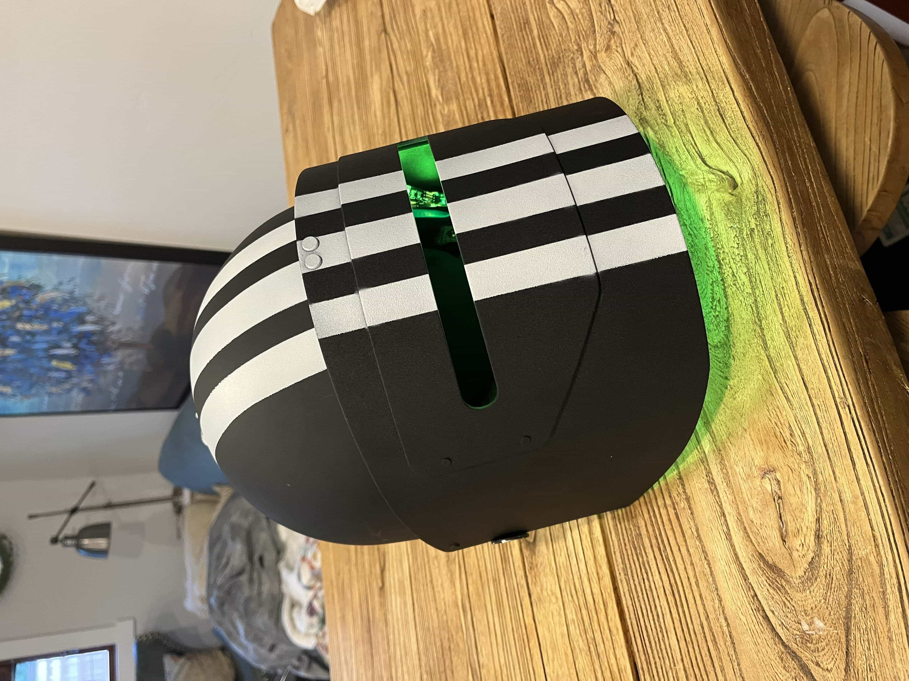
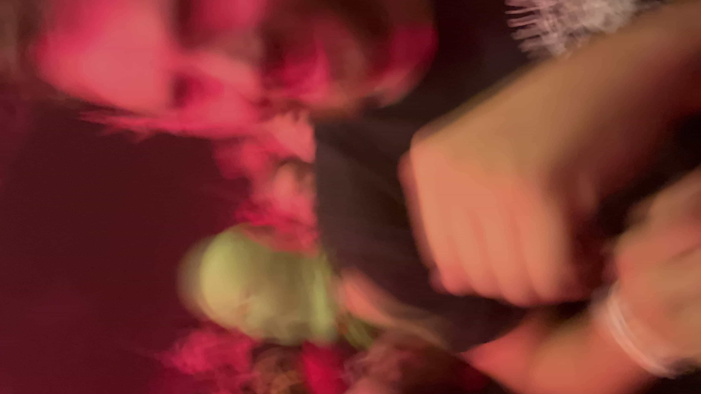
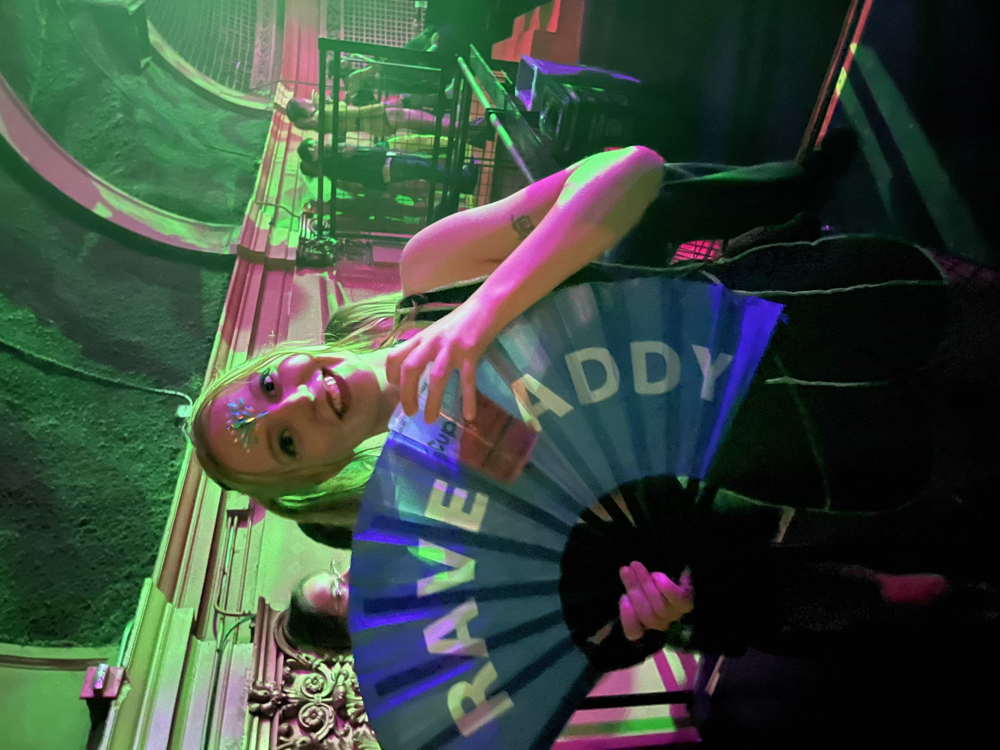
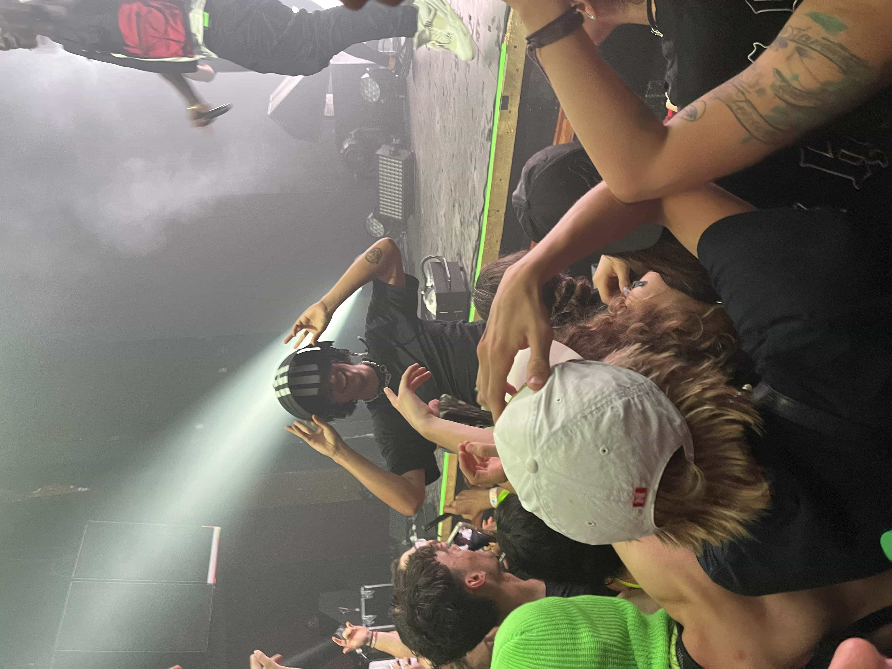
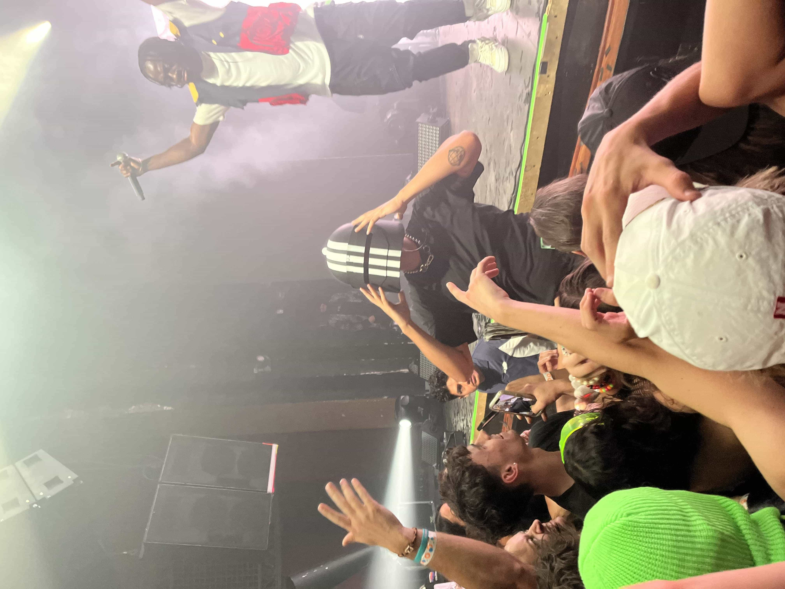
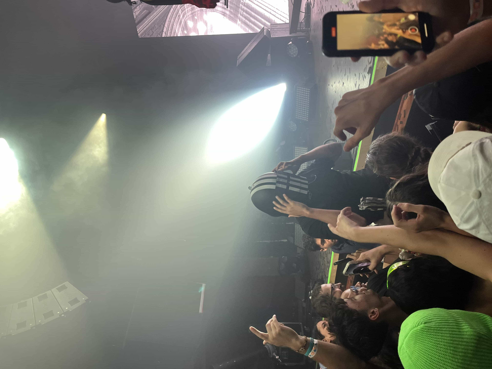
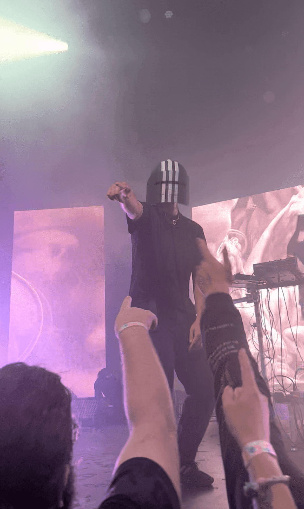
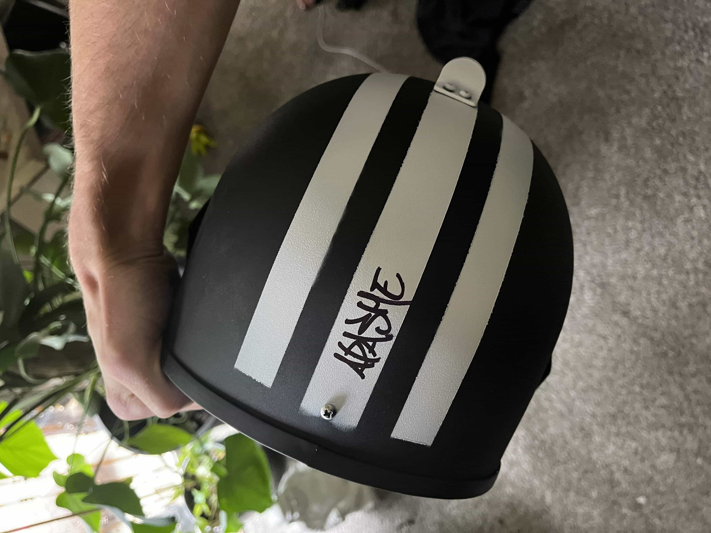
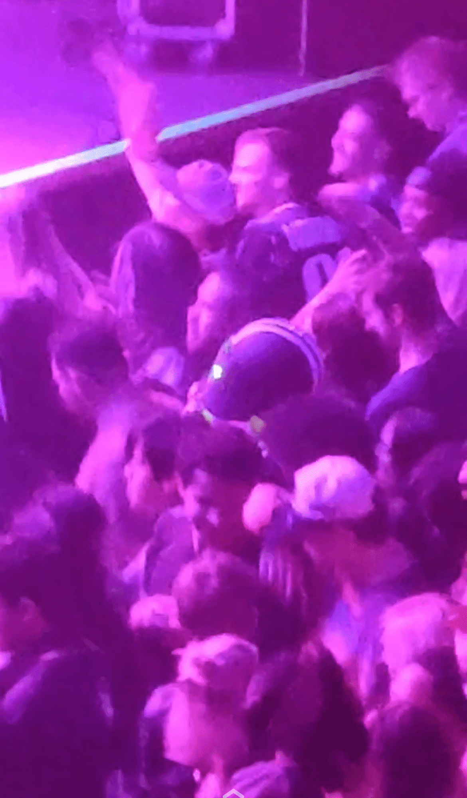
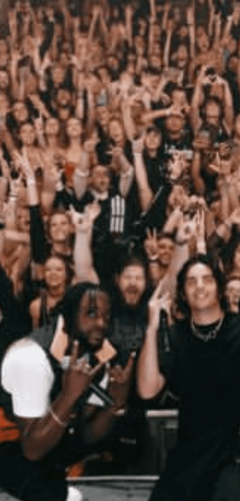

## Apashe

The Apashe concert at The Ogden in Denver will forever be a core memory of mine...

Apashe is one of my all time favorite artists. He does experimental music by blending classical music and electronic music together in a way that is just absolutely magical. He is one of the few artists that I can just listen to their music on repeat for hours and never get bored.

The first time I saw Apashe was in Seattle in 2021. It was an amazing show and I went with my partner Leah. When he announced his show in Denver, my friends all purchased tickets in rapid succession. Not only would I get to see Apashe live again, but this time I would be able to bounce to his tunes with all my friends 🤘

My friends all happen to be really into this game called Escape from Tarkov (EFT). We had the idea to all go to his show dressed as "scavs". In the EFT game, "scavs" are essentially really basic enemies and they are hostile russian civilians. To replicate their look, we all went dressed in full Adidas tracksuits. I was in a fully black and white Adidas tracksuit but with a twist... There is a boss in the game named "Killa". He wears a solid steel Russian combat helmet with three Adidas stripes on it. I ordered a replica helmet for EDF ([EDF post link](/posts/edf)) as my DJ costume that summer. I decided to wear it to Apashe's concert as the leader of the "scav" army.

I wasn't even sure if such a helmet would be allowed into the venue so I emailed the owner's of The Ogden almost a month in advance to get permission and they approved.

We bounced and danced the entire night at Apashe's show right on the front rail and in the mosh pit up front. It was a phenomenal show and the audience had a super high energy.

Towards the end of the show Apashe got right up front and came down into the crowd. He was only about 4 people in front of me and I knew what needed to be done...

In a single motion I remove my helmet and presented it towards Apashe like a knight presenting a crown to a king. Apashe's jaw dropped, he stopped everything that he was doing and extended his arms for the Killa helmet. He looked in awe at the helmet for a moment before turning it around and placing it upon his glorious head. The audience exploded with a roar as he stood up displaying the magnificent helmet. The beat dropped back into his song and he danced in front of the entire venue. It was a sight to behold and my friends all looked at each other just screaming and laughing. It was spectacular and will forever be a core memory.

To top it all off, after the show was over, I chatted with Apashe briefly and even got the helmet signed 🤩

### Pictures 📸

> The Killa helmet with the LEDs turned on

> RAVE ~~D~~ADDY

> Fellow scav spotted in a green balaclava

> Apashe putting on the Killa helmet

> Helmet applied

> Locked and loaded

> 100% majestic

> Iconic

> Signed helmet

> A view of me in the helmet from above

> Me in the Killa helmet, front and center
