## Bean Quest 2.0

> 👋 Hey, if you are looking for the first post about Bean Quest 1.0, [click the link here](/posts/bean-quest-1)

It had been about a month since the legendary **Bean Quest 1.0** event and we knew we had to go bigger and better. I reached out to DC to see if we could book Vision Quest for another Saturday in a couple of weeks. It was short notice but he penciled us in so we got to planning.

### Planning ✏️

This time we wanted to improve upon a few things after our first event. We wanted to improve the following:

- More lights
- Lasers
- Way more speakers
- Using Daniel's light board
- More people

So the first step in planning was to simply update our poster. I through on one new DJ name (INA - Ian C.), updated the date, and it was good to go.

I also went ahead and created a dedicated website to Bean Quest so we could have a URL to quickly share with people to help spread the word - [bean-quest.birki.io](https://bean-quest.birki.io/)

This website and the poster were shared on edmtrain, FaceBook event groups for Boulder, and shared with all of our friends.

Since we did this event with a lot planning time, we got to practicing our DJ sets pretty quickly.

### The Event 🥳

We were all really impressed with how well the first Bean Quest went (including the staff of Vision Quest) and we were all extremely impressed to see that Bean Quest 2.0 was a huge improvement. We had nearly double the turnout and everyone that showed up stuck around for a lot longer. We had killer drink sales, a lot of dancing, and I think Jorit opened up the first ever mosh pit at Vision Quest (and maybe the last).

#### Equipment

I think the huge success from this second rendition of the Bean Quest really came from the equipment. We had double the lights, two boxes of lasers, spot lights, and a rotating LED light. To top it all off, Daniel assembled his LED board and it looked like we were actual DJs at a festival. Combine all that with a fog machine and you're destined to have a great time.

### Pictures 📸

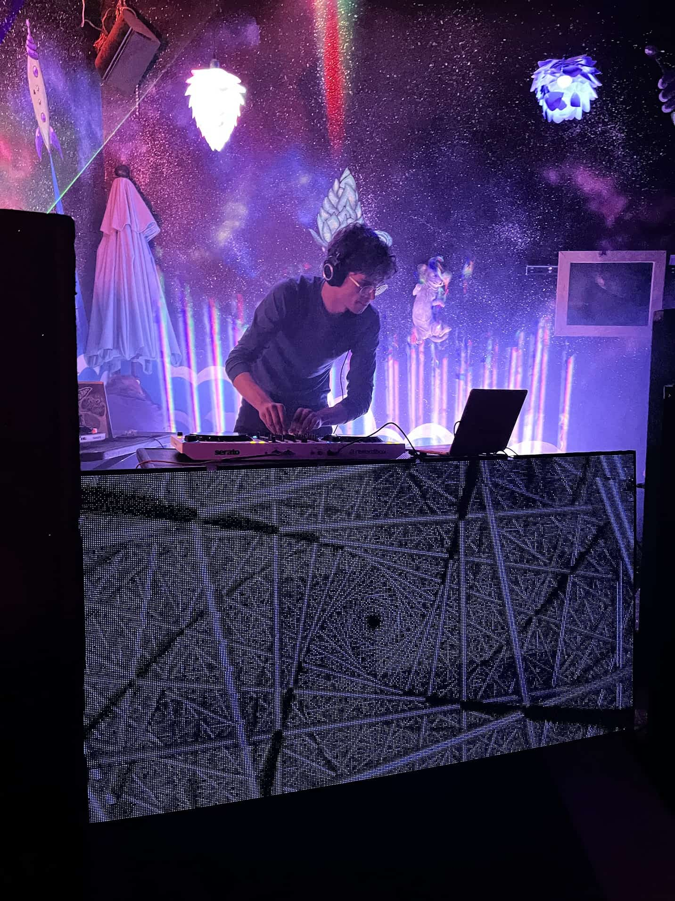

> INA (Ian C.) on the decks

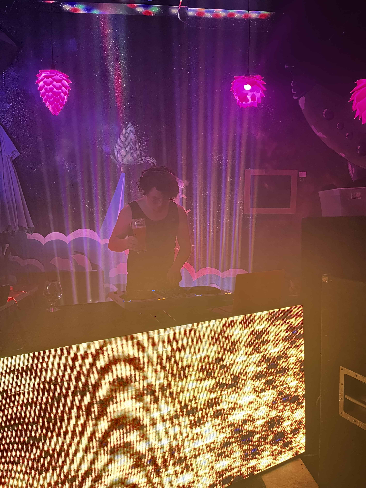

> HRDR DDI (Ian W.) on the decks

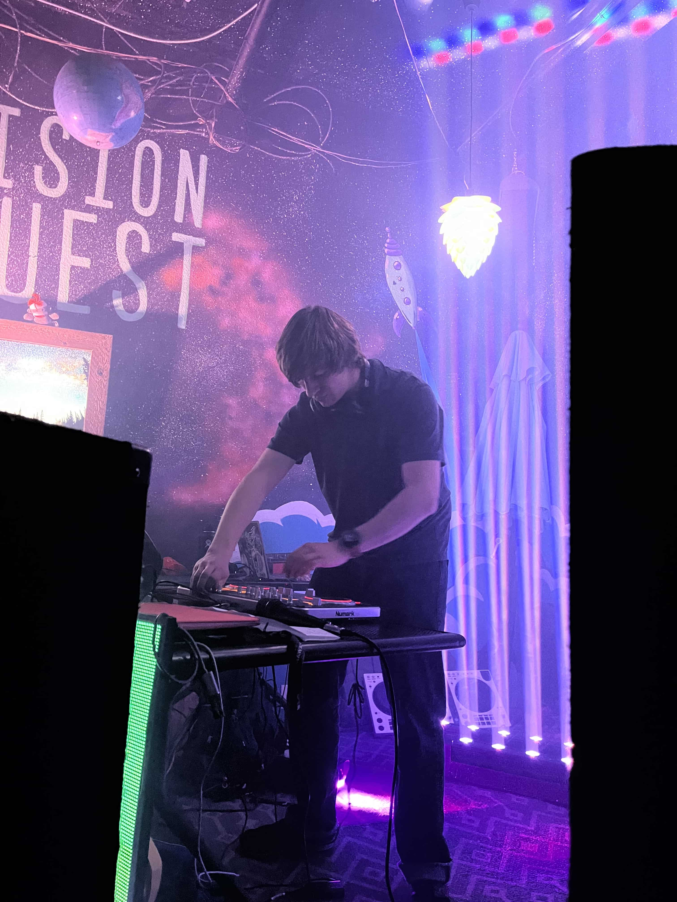

> PUDDLES (Sam S.) on the decks

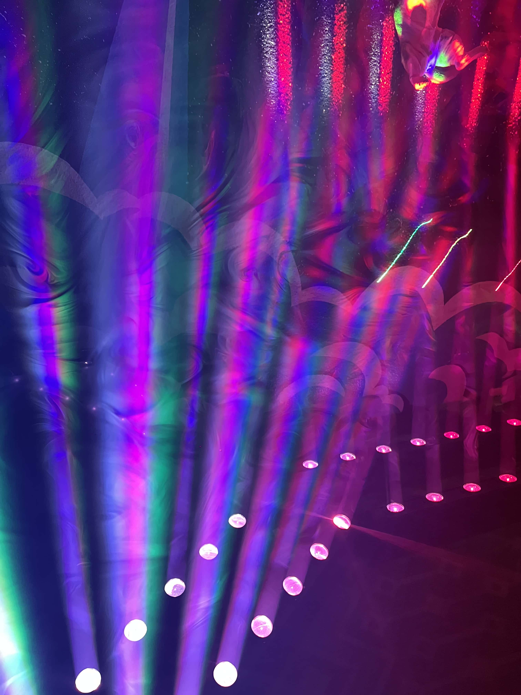

> Daniel's lighting setup

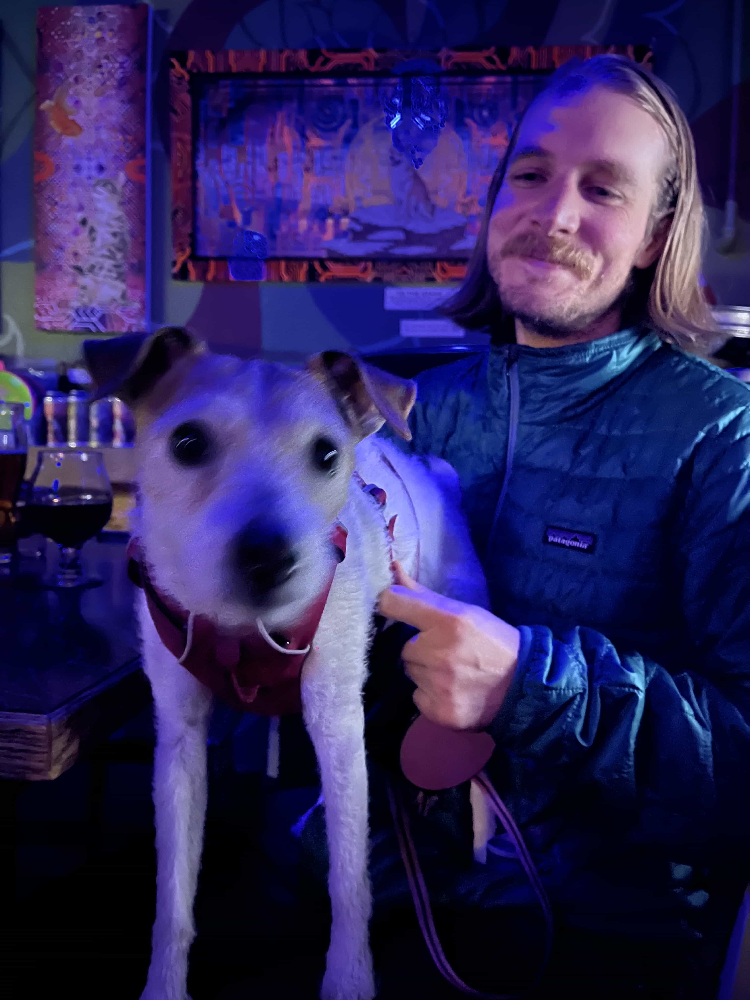

> Surprise doggo

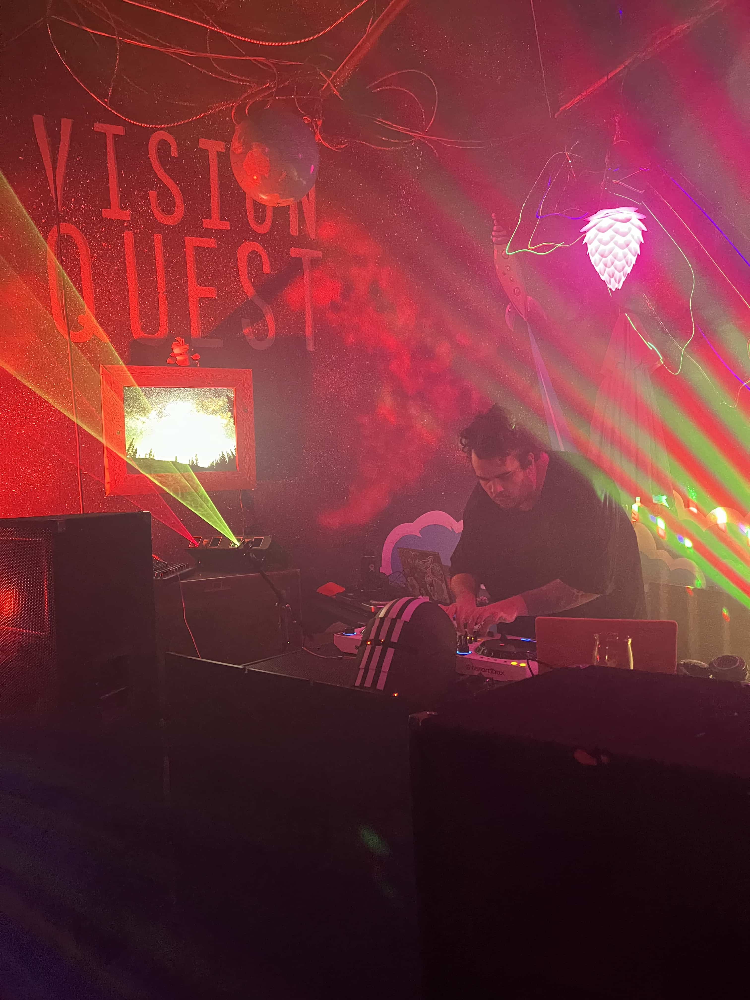

> MAC AND Gs (Garrett D.) on the decks

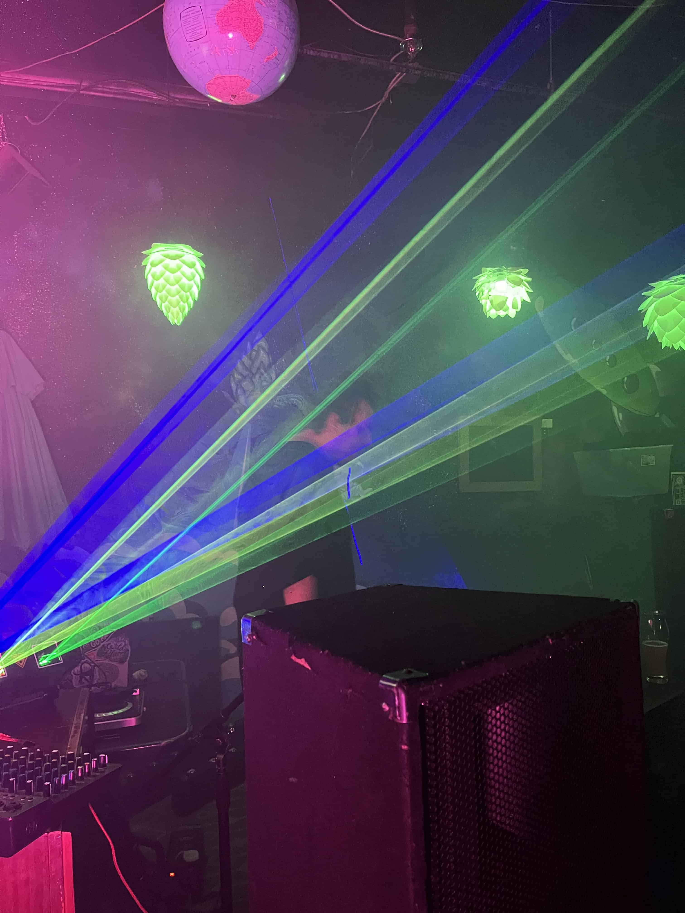

> MAC AND Gs with lasers

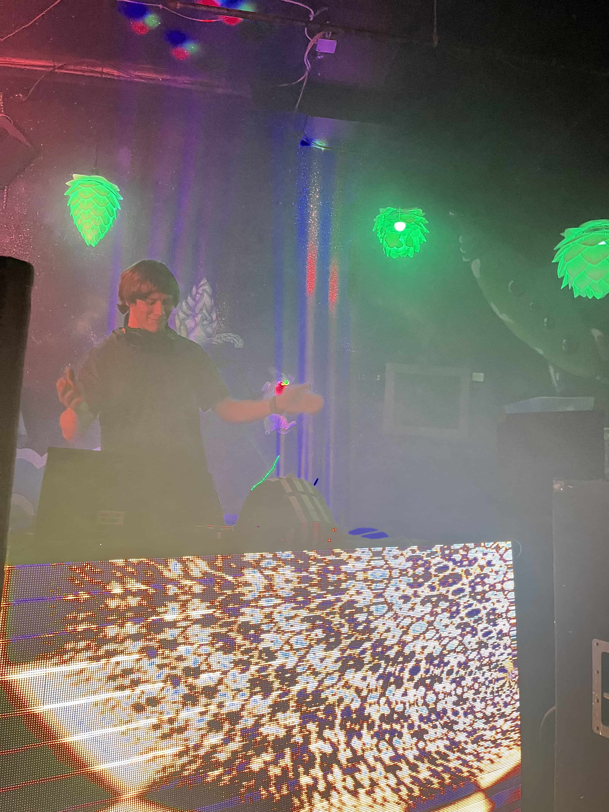

> PUDDLES vibing

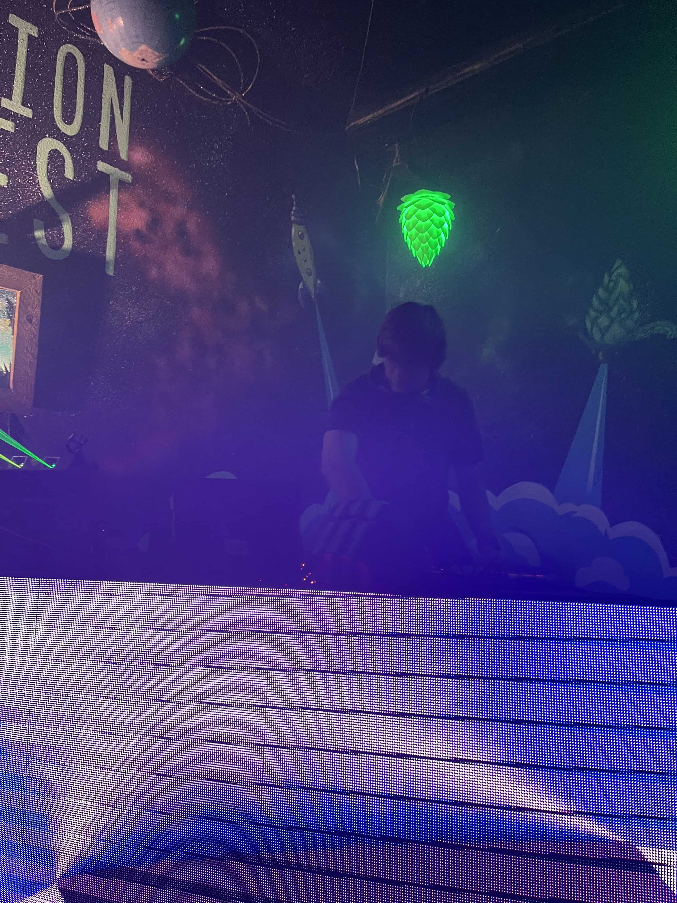

> PUDDLES doing a thing

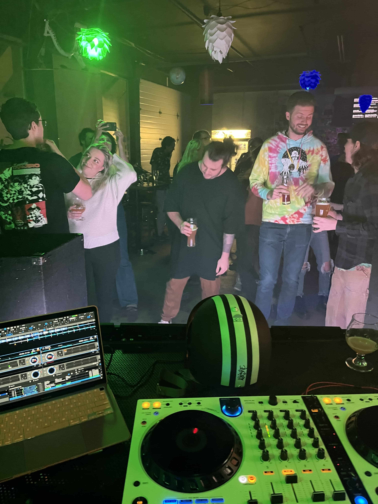

> View from BORSCHT's set

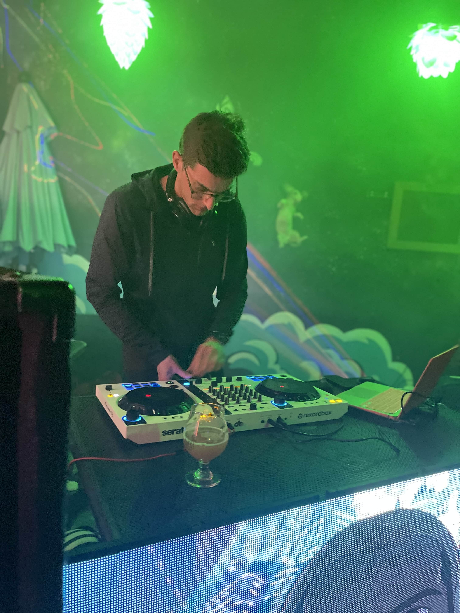

> BORSCHT (Grant B.) on the decks

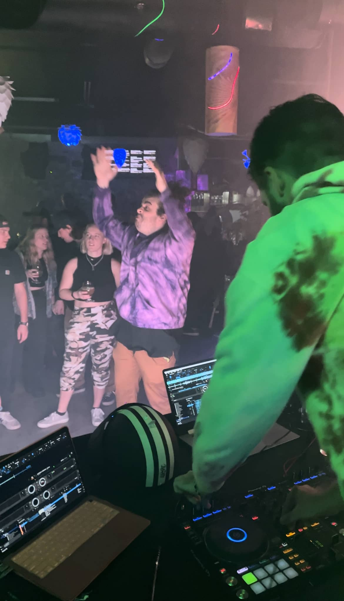

> SILENT J and Garrett vibing

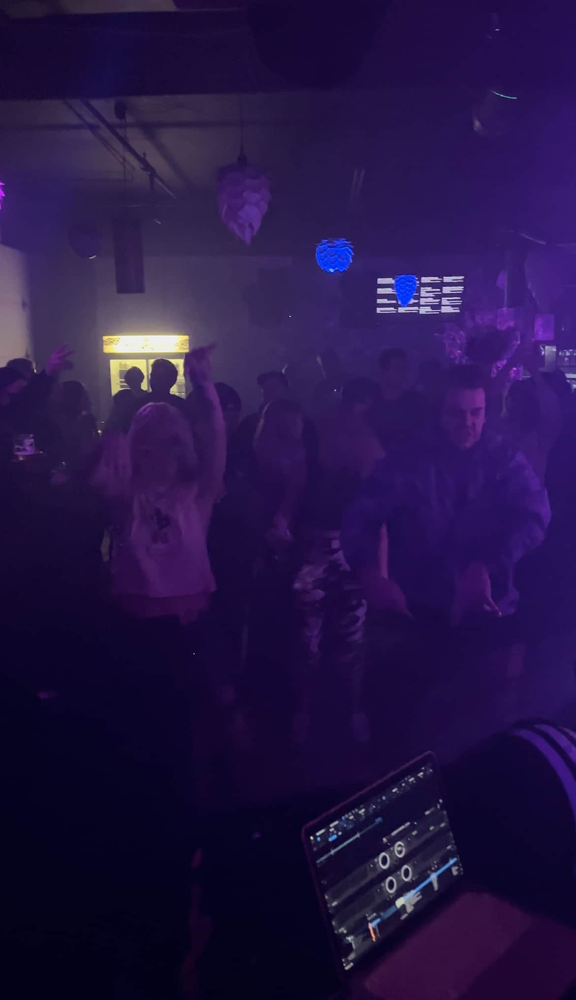

> Everyone bouncing

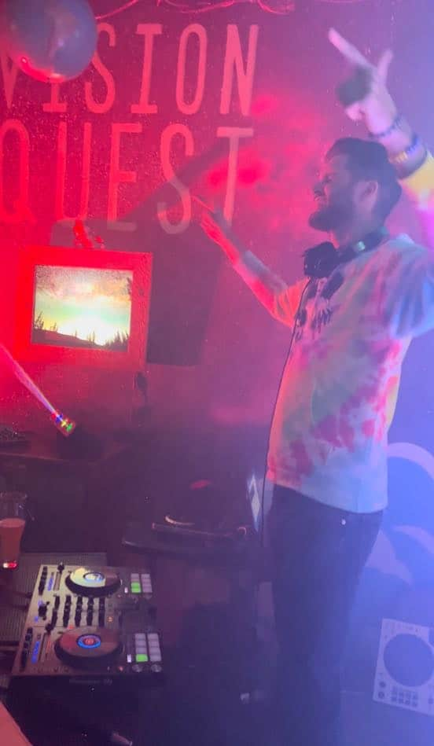

> SILENT J. - The creator of Vision Quest's first ever tear-out mosh pit
