## December 2022

December 2022 was a really great month that was just absolutely packed with good times.

### Reaper 🤘

The month started off with Reaper at the Church. We started off in the "riddim room" and then proceeded to wreck our bodies to Drum and Bass for hours on end.

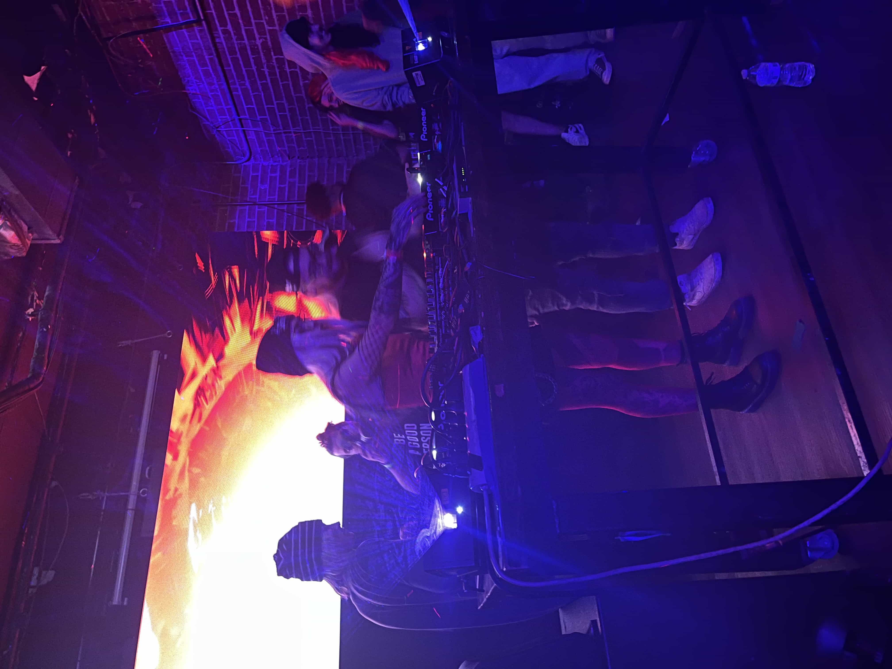

> The "riddim room"

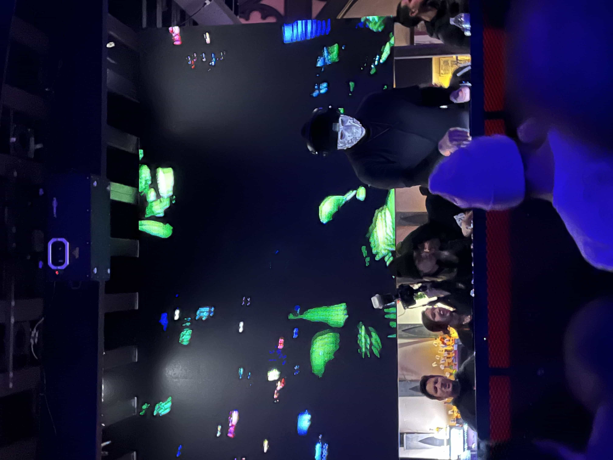

> Reaper

### Bean Quest Weekend 🥳

We started off Bean Quest 1.0 weekend with Korean Karaoke

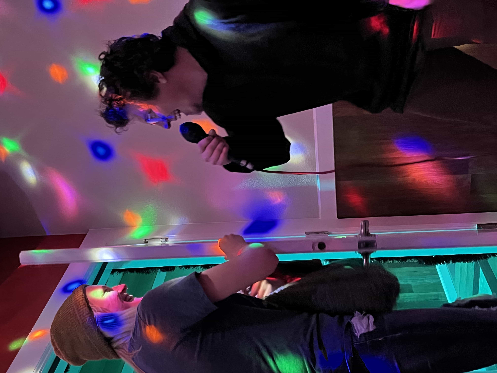

> Ian and Taylor

The day of Bean Quest 1.0, we went for a hike near the Flat Irons in Boulder

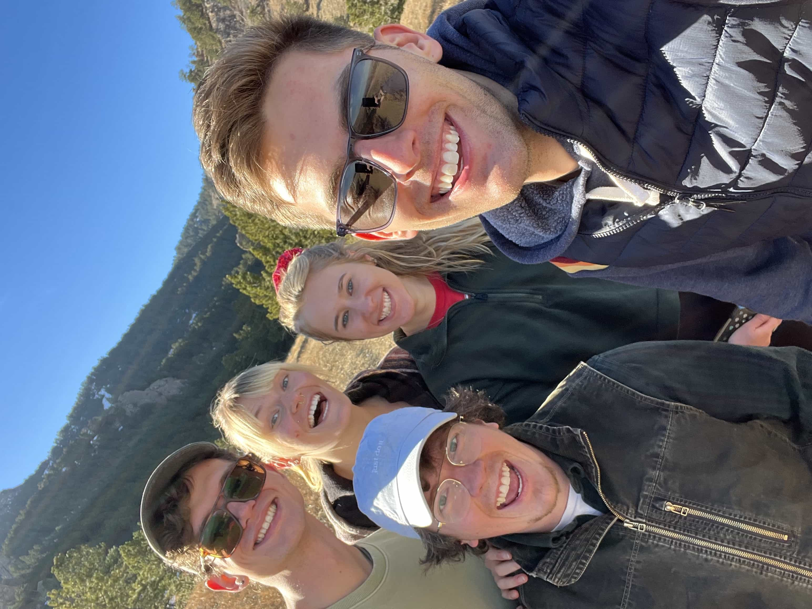

Then later that night we bounced at Vision Quest!

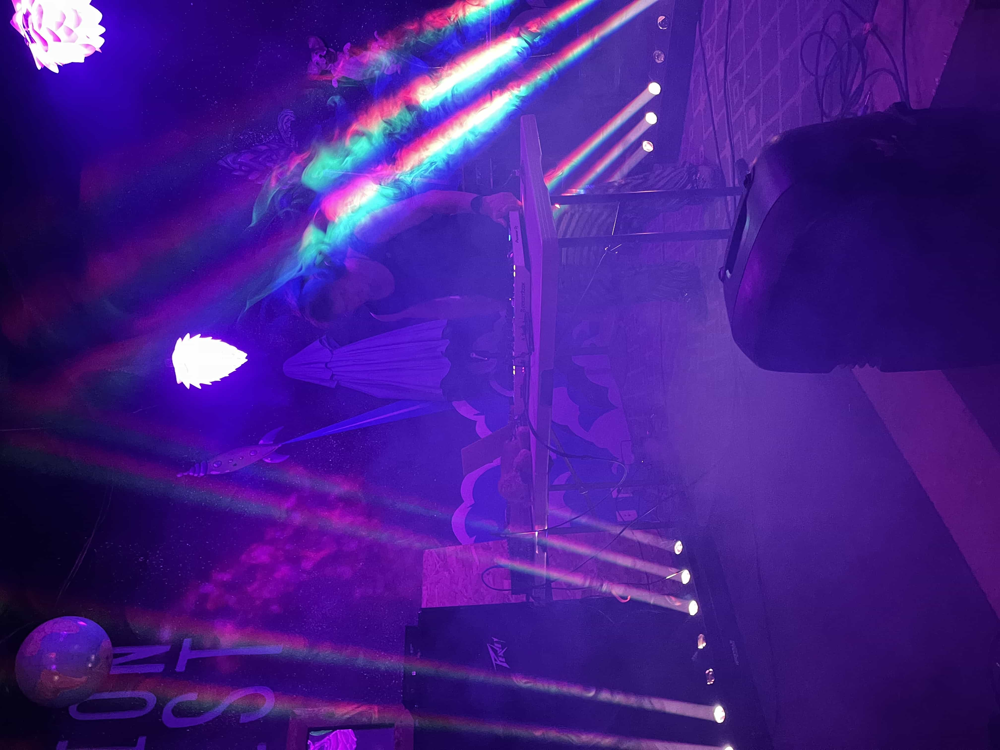

> You can read the separate post about Bean Quest 1.0 by [clicking the link here](/posts/bean-quest-1)

### Leah Comes Home 🌟

Leah came home to visit while on Winter break from her master program at Kings College London!

> G + L on a hike in the Flat Irons (Boulder, CO)

Soon after Leah got there, we flew out to Arizona to see my brother Brooks graduate from GCU. Leah surprised Brooks and he had no idea she was coming to visit!

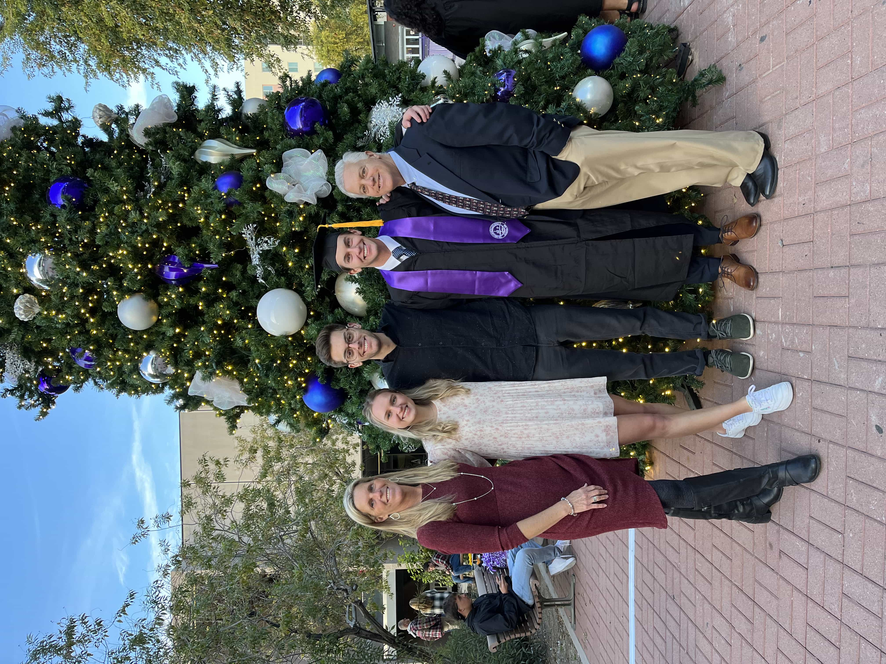

When Leah and I got back to CO, we went to Steamboat for xmas to ski, snowmobile, and bake **a lot** of cookies

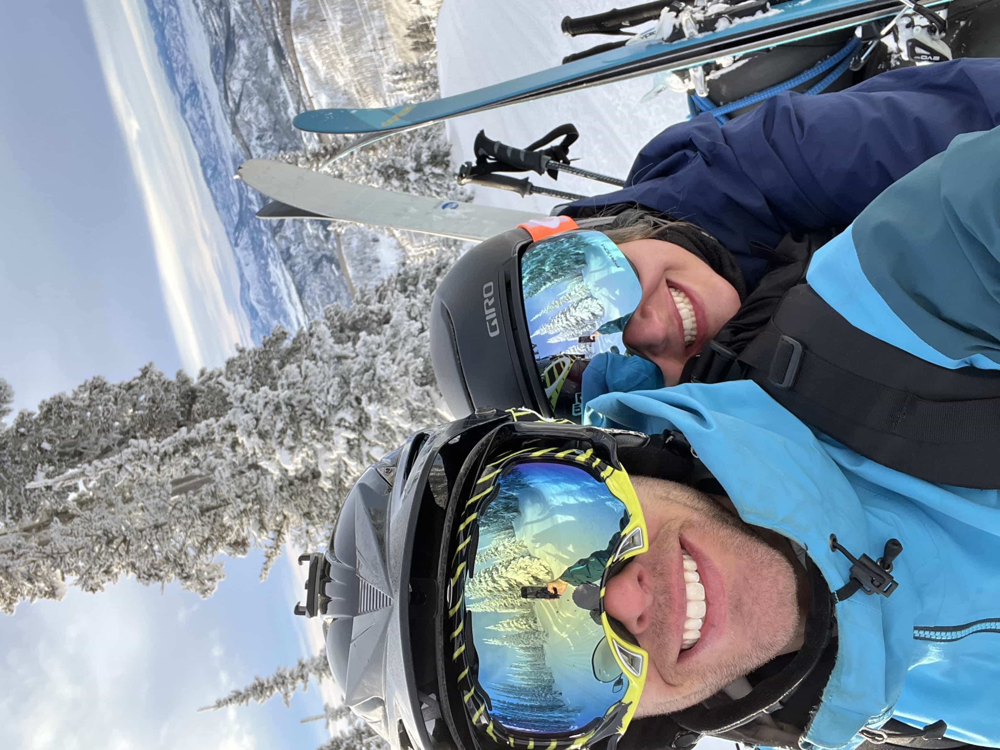

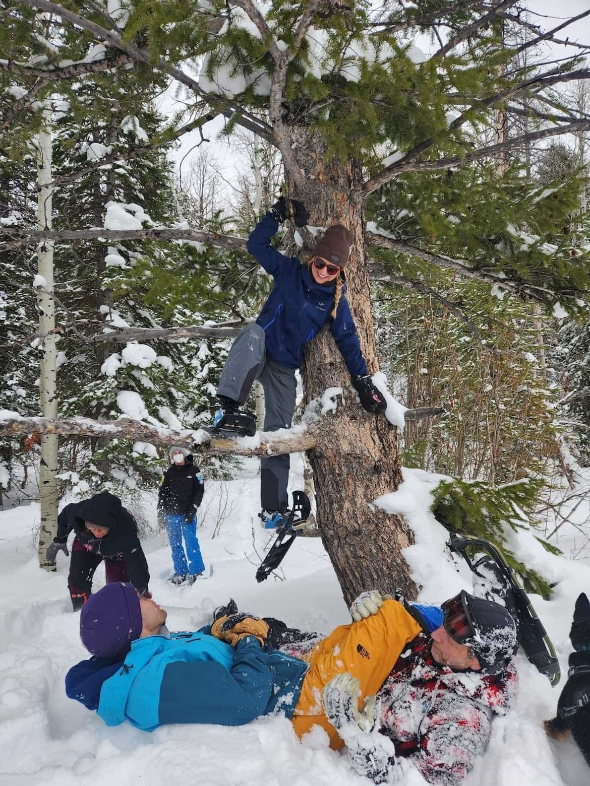

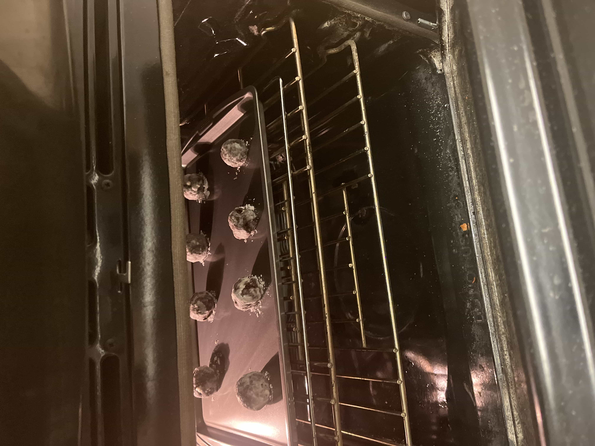

For an xmas gift to the Caragol's, I prepared a mushroom version of a beef wellington and it was 🔥

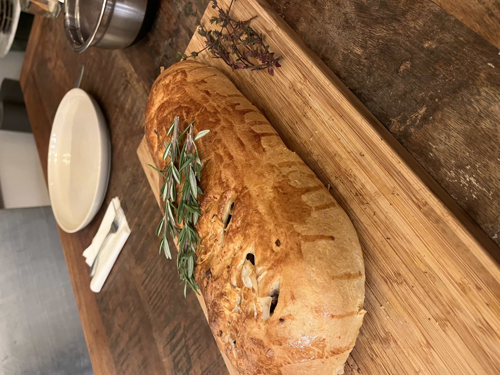

### Decadence 🎵

To close out December and the year of 2022, all of my friends went to Decadence NYE in Denver, CO. It is a two day EDM show and it was an absolute blast.

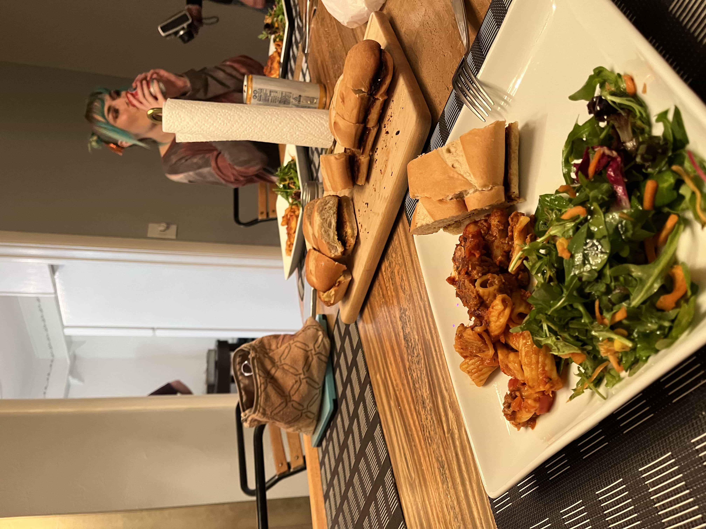

> Eating a delicious dinner prepared by Jake before night 1 of Decadence

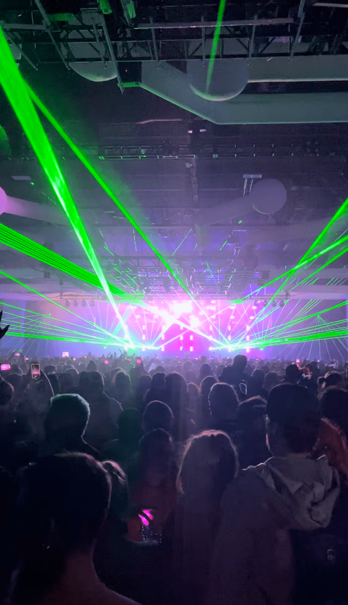
