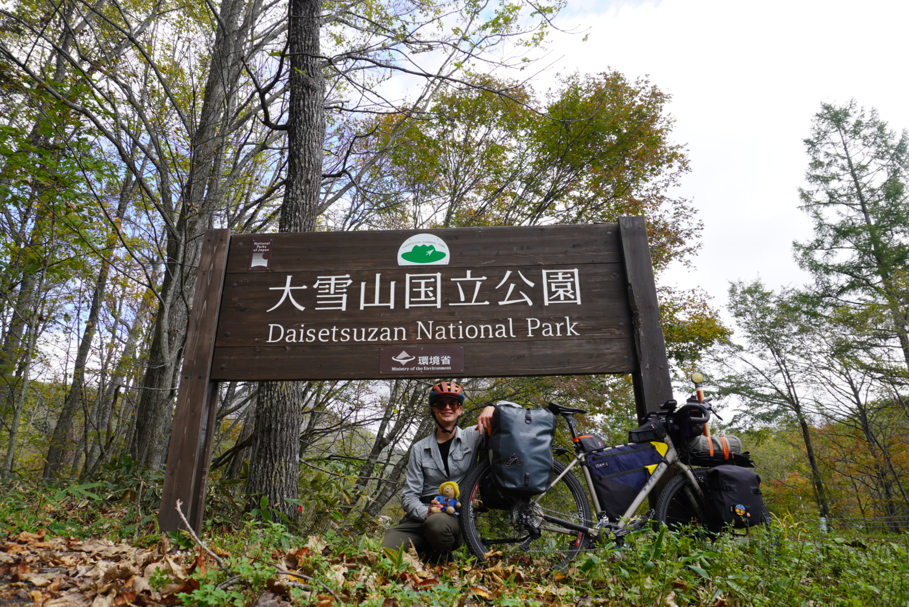
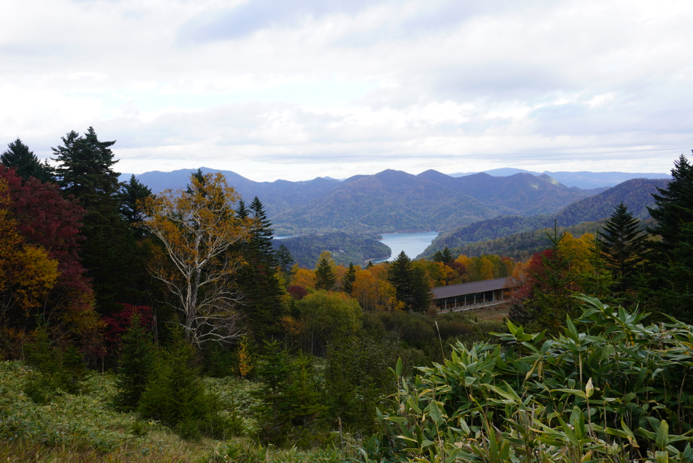
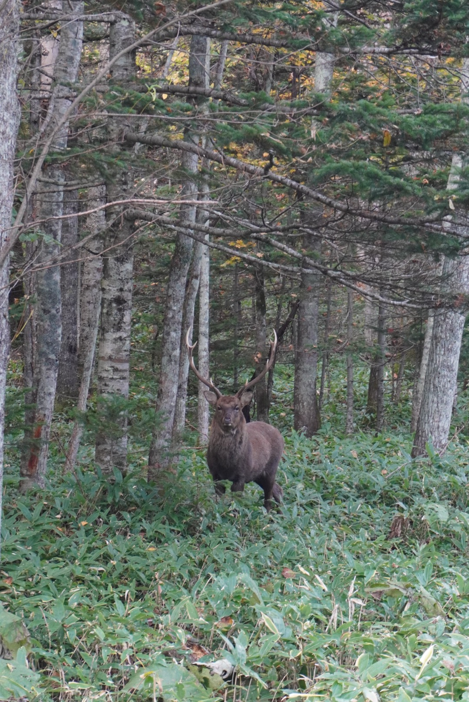
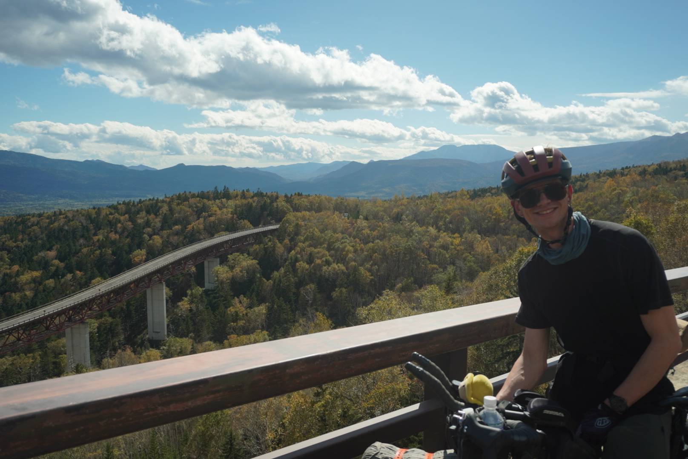
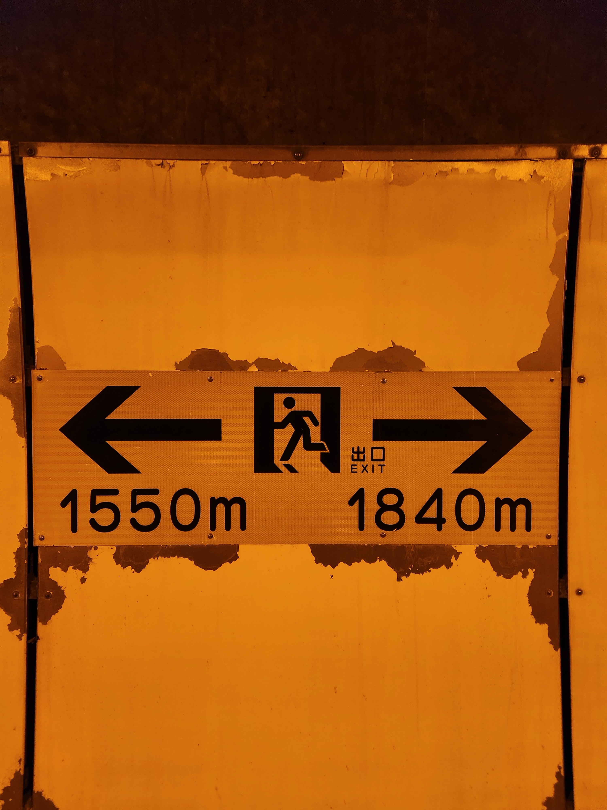
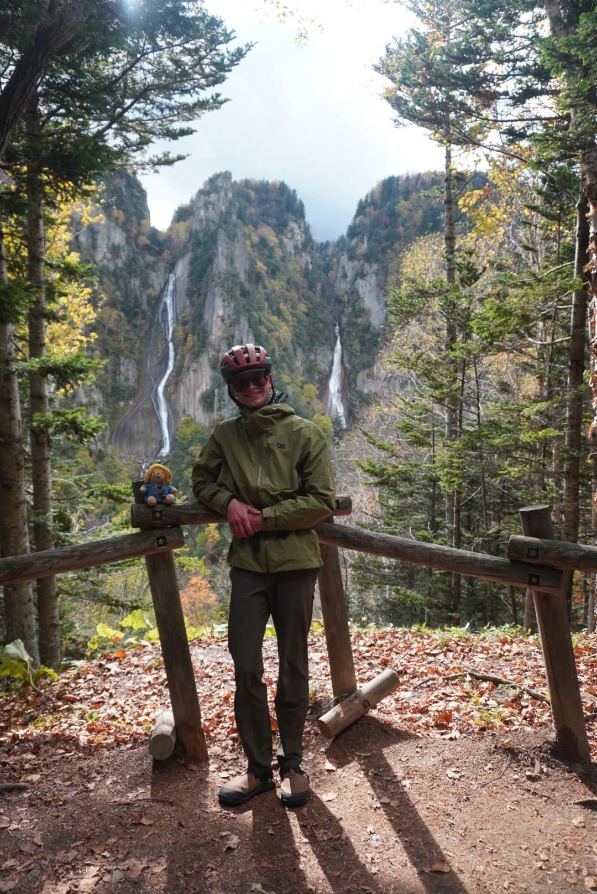

## Daisetsuzsan National Park

Fueled by a double helping of Shoki-San’s breakfast I left Shikaoi to climb into the mountains of Daisetsuzan National Park. The climb was slow and quiet. The flora changed drastically as I wound my way up the mountainside, from broad leaf shrubs to pine trees. It felt like riding into fall. With each corner it got colder and colder.

When I reached the top of the first pass, and looked down on Lake Shikaribetbsu, I knew that the tough climbs ahead would be worth it. It was beautiful, the road dropped to one lane as it followed the shore through a tunnel of fall foliage. But as the temperature dropped I found myself facing a conundrum. Do I ride faster to stay warm and make it to Nukabura before dark? Or do I take in the sights and meander along the lake?

In the end the weather made the decision for me. I had to push less I get too cold. I had originally intended to camp in Nukabura, but when I realized it was going to be below freezing I looked around for some accommodation. This tiny town consisted of the visitor center (which was excellent), two onsen (too expensive), a campground (too cold), a single restaurant (closed), and a youth hostel (with exactly one room available).

### Nikeburo to Sounkyo - up and over Mikuni Pass

In the morning, fueled by a traditional Japanese breakfast of rice, fish, pickled vegetables, and miso soup, I set off to climb Mikuni pass. Along the way I was greeted by many elk, some even ran alongside me for a few hundred meters. Or perhaps I was riding alongside them.

Mikuni Pass turned out to be one of my favorite climbs of all time. There was very little traffic and the weather was great. In some spots, the engineers decided to simply build the road _above_ the forest, rather than through it. Each bridge I crossed revealed an even grander view.

But once I crossed through the tunnel at the top, I found myself putting on all of my layers, it was starting to snow!

Tired and cold, I pushed towards Sounkyo. Sounkyo is a resort town with several onsen and a family mart. I had booked two nights at the hostel there and was looking forward to warming up. In my way was my longest tunnel yet, 3.2 km (2 mi). Luckily this tunnel had a pedestrian path, but it was closed! About halfway through the tunnel, I decided to ignore said closure, and hopped on the path.

Just after the tunnel I saw a turn off for some kind of waterfall. I decided to stop and check it out. That’s one of the things I am trying to do more of while touring. It’s easy to focus on getting to your destination as fast as possible, and depending on the weather, that may be preferable. But sometimes, you need to do the side quest!

It turned out to be two beautiful water falls, called the “Wedded Falls”. Even cooler, was that I would see the source of these falls the next day, when I climbed Mt. Hokuchin!

### Anti-Rest Day - Climbing Mt. Hokuchin

