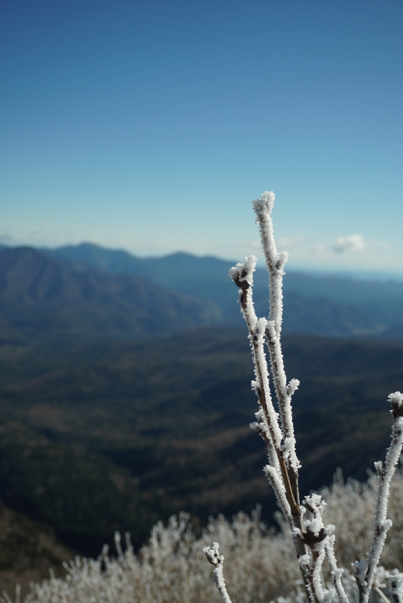
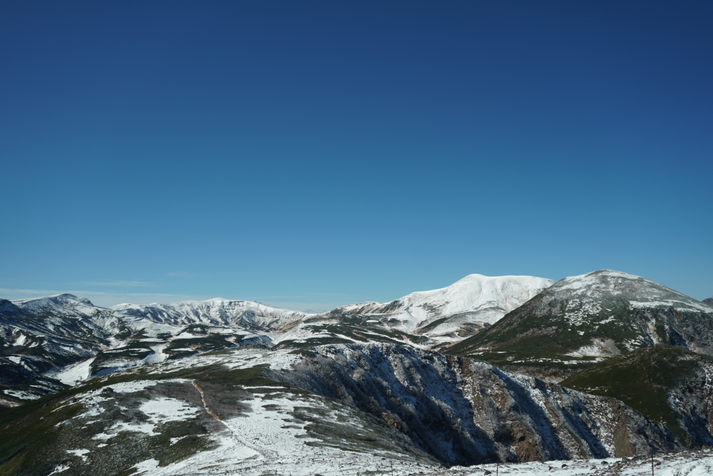
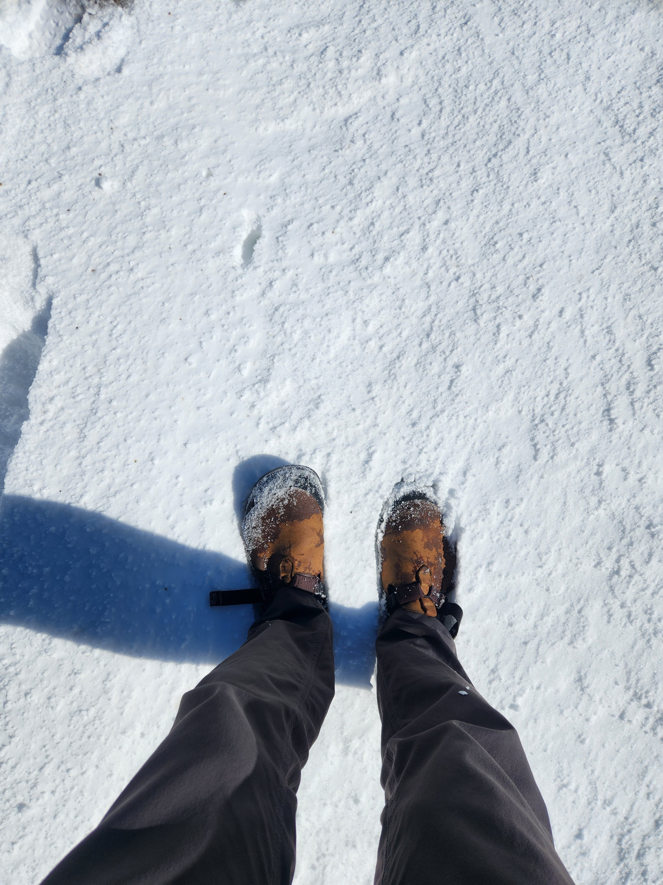
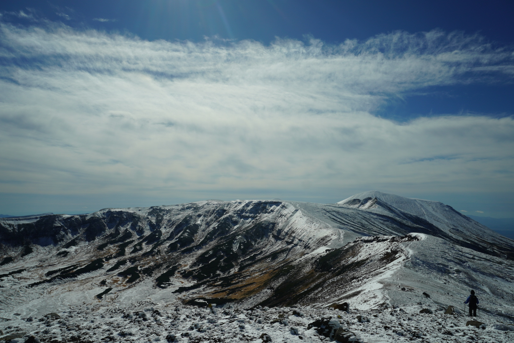
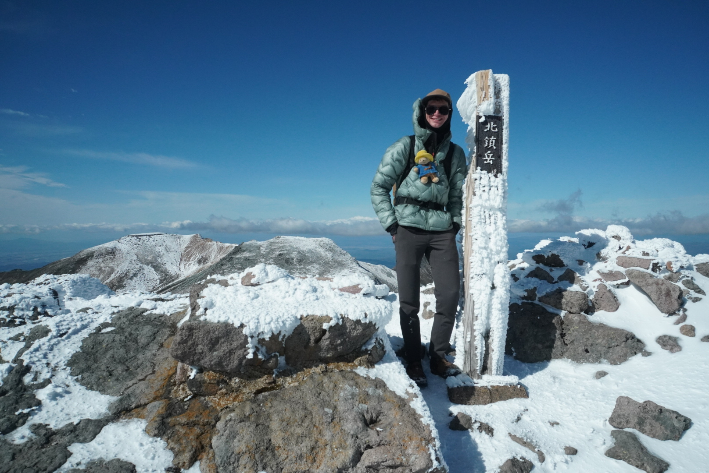
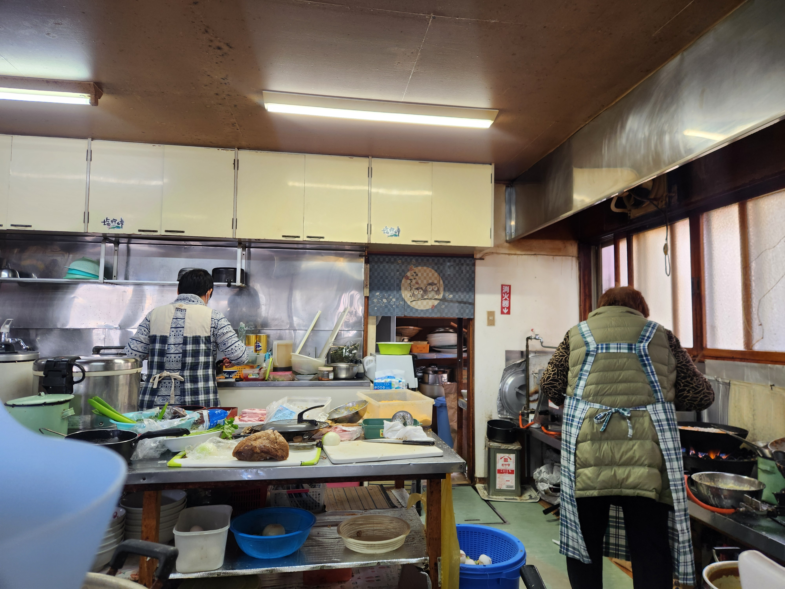
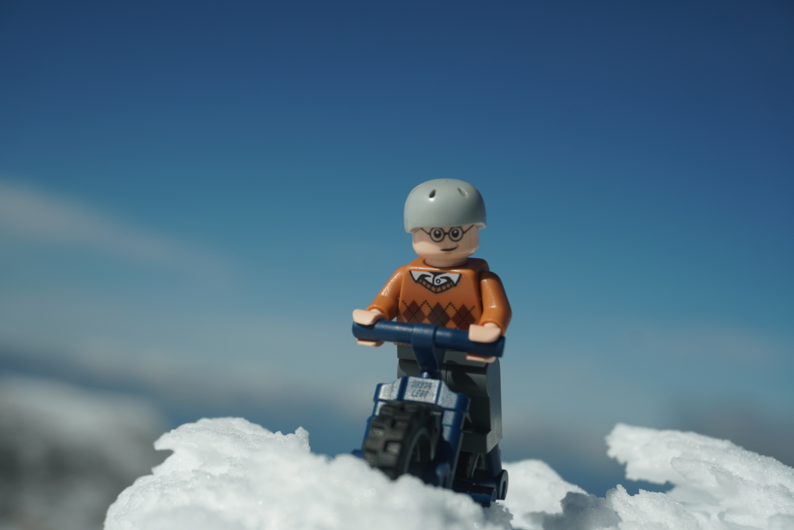

## Daisetsuzsan National Park

Fueled by a double helping of Shoki-San’s breakfast I left Shikaoi to climb into the mountains of Daisetsuzan National Park. The climb was slow and quiet. The flora changed drastically as I wound my way up the mountainside, from broad leaf shrubs to pine trees. It felt like riding into fall and with each corner it got colder and colder.

When I reached the top of the first pass, and looked down on Lake Shikaribetbsu, I knew that the tough climbs ahead would be worth it. It was beautiful, the road dropped to one lane as it followed the shore through a tunnel of fall foliage. But as the temperature dropped I found myself facing a conundrum. Do I ride faster to stay warm and make it to Nukabura before dark? Or do I take in the sights and meander along the lake?

In the end the weather made the decision for me. I had to push less I get too cold. I had originally intended to camp in Nukabura, but when I realized it was going to be below freezing I looked around for some accommodation. This tiny town consisted of the visitor center (which was excellent), two onsen (too expensive), a campground (too cold), a single restaurant (closed), and a youth hostel (with exactly one room available).

### Nikeburo to Sounkyo - up and over Mikuni Pass

In the morning, fueled by a traditional Japanese breakfast of rice, fish, pickled vegetables, and miso soup, I set off to climb Mikuni pass. Along the way I was greeted by many elk, some even ran alongside me for a few hundred meters. Or perhaps I was riding alongside them.

Mikuni Pass turned out to be one of my favorite climbs of all time. There was very little traffic and the weather was great. In some spots, the engineers decided to simply build the road _above_ the forest, rather than through it. Each bridge I crossed revealed an even grander view.

But once I crossed through the tunnel at the top, I found myself putting on all of my layers, it was starting to snow!

Tired and cold, I pushed towards Sounkyo. Sounkyo is a resort town with several onsen and a family mart. I had booked two nights at the hostel there and was looking forward to warming up. In my way was my longest tunnel yet, 3.2 km (2 mi). Luckily this tunnel had a pedestrian path, but it was closed! About halfway through the tunnel, I decided to ignore said closure, and hopped on the path.

Just after the tunnel I saw a turn off for some kind of waterfall. I decided to stop and check it out. That’s one of the things I am trying to do more of while touring. It’s easy to focus on getting to your destination as fast as possible, and depending on the weather, that may be preferable. But sometimes, you need to do the side quest!

It turned out to be two beautiful water falls, called the “Wedded Falls”. Even cooler, was that I would see the source of these falls the next day, when I climbed Mt. Hokuchin!

The Sounkyo hostel was comfortable and quiet. They recommended a few Onsen - I went to the local one and was finally able to warm up.

### Anti-Rest Day - Climbing Mt. Hokuchin

Let me start this section by saying - this was the worst rest day in history. But, it was one of the best hikes that I have ever done.

Keen on seeing more of the park, I decided to catch the first tram up the mountain. As I was I was purchasing my ticket a huge tour showed up and got in line. Suddenly the tram line went from 4 people to over a hundred! They got in line while the guide went and purchased the tickets.

I thought this was unfair, and luckily the couple behind me did two. I could hear them complain to the staff member, and although I could not have complained myself, I could understand what was going on. So I stuck as close to them as possible, and the staff member let us to the front of the line.

The tram only takes you about 1/3 of the way up. From there you can take a chairlift, but, being cheap, I decided to skip the chairlift. Instead I took a frozen and muddy trail that had not see any maintenance (or perhaps traffic) in what seemed like years. That seems like an excellent way to encourage folks to take the chairlift!

Then began the climb up to Mt. Kurodake. I wanted to do a very long loop, so I practically ran up that mountain. And indeed, I was the first one at the top. As it got progressively more icy and snowy I began to question my choice of shoes. How far can you push bedrock clogs?

At the top of Kurodake was a small shrine, and this incredible view.

With this view I could hear the mountains calling - could I make it to Asahidake? The tallest mountain in Hokkaido?

I prayed for good weather and for the continued health of my feet, and set off! I adopted the questionable “move as fast as possible and you won’t get cold” strategy. This is becoming my go to techinque.

As the snow drifts got deeper and deeper, and the wind picked up, I began to question my decisions. Asahidake would not be possible, it was too far, and the afternoon forecast was terrible. But - Hokuchin was just right there… I could see the peak!

So I ran up Mt. Hokuchin and found myself blown away. By the wind and by the view of the Asahikawa valley below.

On the way back down, I got to practice my Jack Sparrow run. The top of Kurodake was now packed with people, and the trail had become a solid sheet of ice from hundreds of feet. There are two ways to approach this type of trail.

1. With caution, each step placed carefully on the least slippery patch of ice
2. In a constant state of falling, but, if you never hit the ground, are you really falling?

I put on the Pirates of the Caribbean soundtrack and opted for option 2. You just have do your best Jack Sparrow impression and trust your feet. I did slip twice, but I made it down in record time!

I was too stubborn to take the tram down, which the exact same mistake I made when I hiked Takayama while I was studying abroad in Tokyo. Back then I decided not to take the cable car down and ended up hiking several miles down, on a forgotten trail. Then I missed the last bus to the station and a stranger was kind enough to give me a ride.

It turns out - 8 years later - I have not learned my lesson.

### Sounkyo to Nayoro

After my anti-rest day, I woke up with legs so sore I could hardly walk up the stairs. However, biking uses an almost entirely different set of muscles! So I set off to Nayoro. I was blessed by a strong tailwind and fueled by an enormous Katsudon made by two grandmothers.

In Nayoro I was faced with a crossroads - but I will save that for next time!

Ian

 

