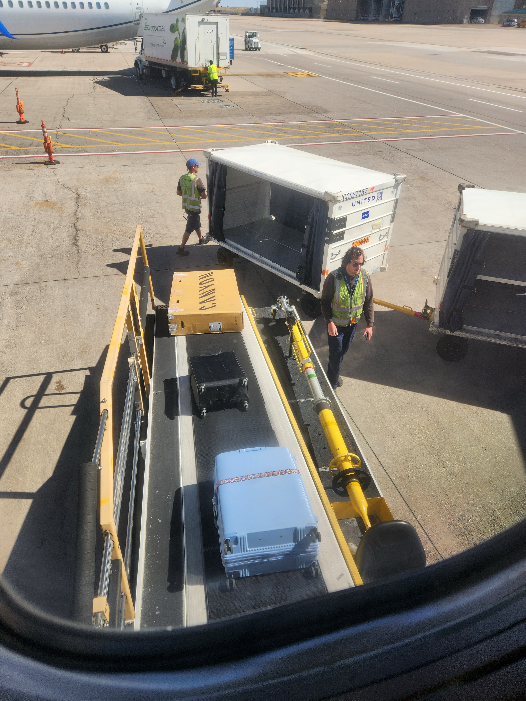
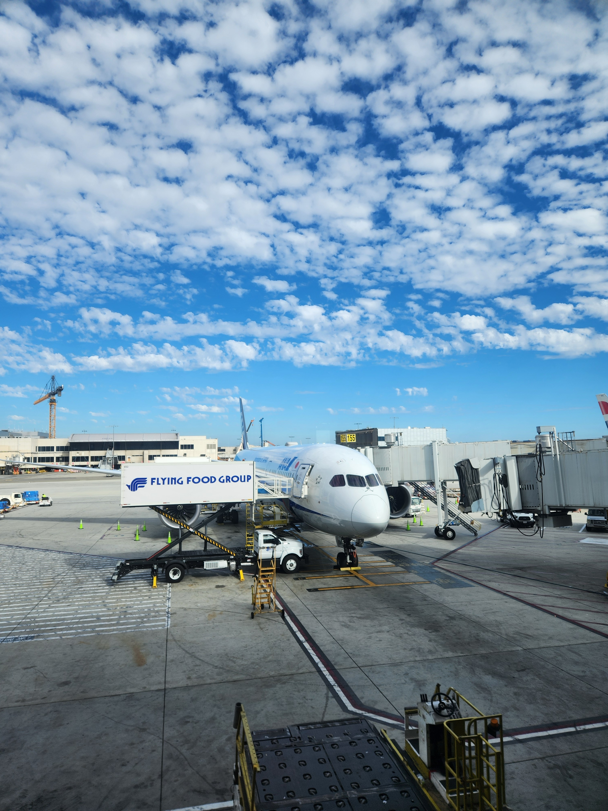
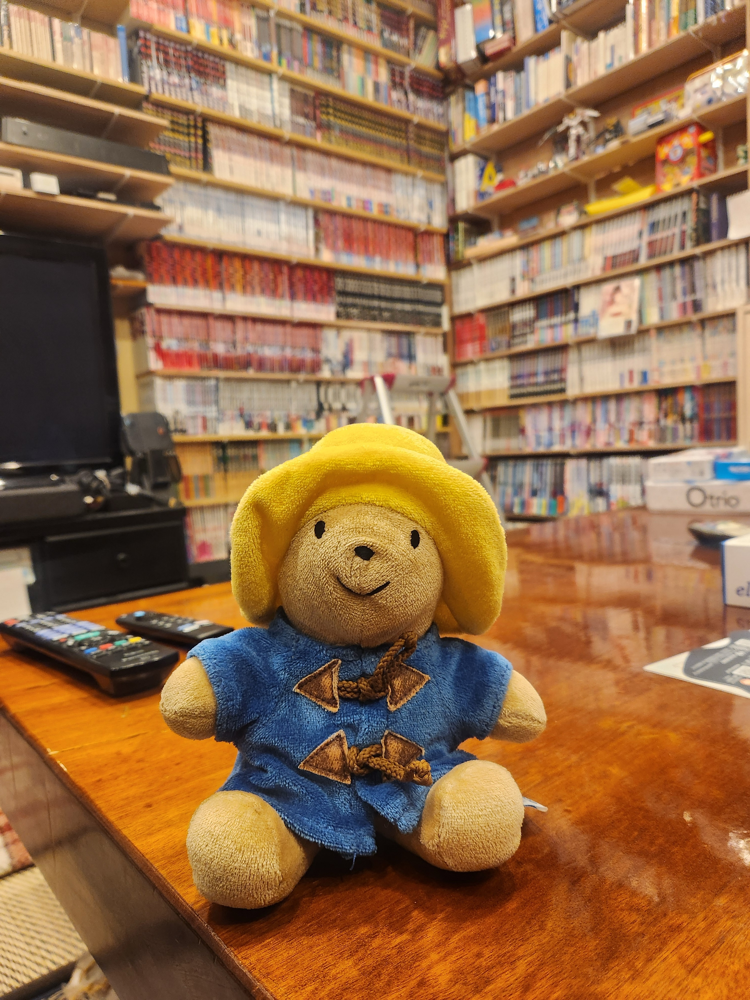
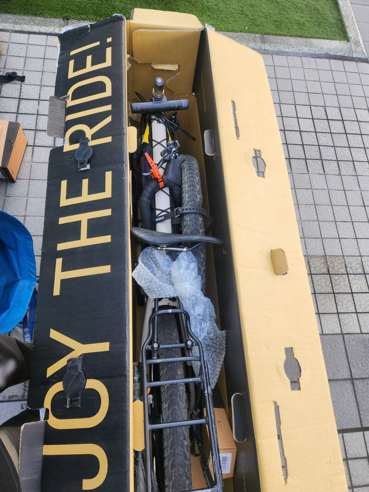

I made it without any trouble, but there were some close calls!

It’s quite difficult to travel with a bike, especially one that is 3 CM under the maximum size allowed by the airplanes, but every employee was incredibly accommodating, and it ended up being quite straightforward. At DIA, they simply took one look at my bike box, let the extra .5 pounds slide, and sent it on its way!

Of course the I forgot to take the water out of my bottle and got scolded by TSA, I wonder how many times that happens a day?

Once you see your bike being loaded onto the plane, you can breathe a big sigh of relief.

Then it was a simple flight to LAX, where I got lost in the giant airport. They really need to work on their signage. I find airports fascinating, there is so much engineering and logistics on display. I watched as the Air Freight was loaded on to the 787 Dreamliner I would be taking to Japan and the Flying Food Group Flight delivered all of our meals. To think that each airline has a different menu, which gets made near the airport that day, then gets delivered to the correct plane, in a box that is designed specifically to not roll away during turbulence and fit down the aisle of a plane. Well - that’s pretty amazing!

My flight was out of a movie. I had a middle seat, and to my left, was Yuni who was terribly sick. He had a horrible cough and fever, but we both wore masks, and the flight attendants took great care of him. They came by at least once an hour worth more tea, medicine, and even a hot pad! It worked out for me too, because I did not feel so bad about asking for some tea myself. To my left, was Rosa. Her whole family was in first class, and she wanted to make the most of being in economy by asking for as much white wine as possible. And the flight attendants were generous! Despite my apprehension in the first 30 minutes of the flight, all was well, and I had two great neighbors. I just ended up watching movies.

Once I landed in Haneda I was pleased to see that my bike had made it, but, I had a problem. I thought that I could just sleep in the Terminal and catch my flight to Sapporo in the morning. BUT since I switched to domestic, I had to pick up all of my luggage, and the domestic terminal closes at night.

I ended up leaving my bike in Luggage storage, which cost as much as my hostel, and catching the train about 15 minutes away. The hostel was great - it had a huge selection of Managua, and a kind host (Toichi-San). But I was only able to spend a few hours there before I had to catch the first train of the morning back to the airport. It reminded me of when I studied in Tokyo, we would stay out all night, and then catch the 5:30 train back home.

This is where things got a little too close for comfort. My plane left at 6:55 AM, and the luggage storage opened at 5:45. So I had just over an hour. But, in my sleep deprived state, I made a mistake, and got off the train at Terminal 3. It turns out Terminal 3 is practically a different airport, so I had to catch the bus to Terminal 2. That was 15 minutes lost.

I quickly picked up my bike, which is HUGE and very difficult to navigate through a crowd ed airport, and made my way to the check in. I was saved by the kind employee who asked when my flight left, when I said it leaves at 6:55, she rushed me to the front of the line. I would not have made the plane without the help of the kind people at the check in counter. They checked my bike for free, because there was not enough time, and security opened it up, and checked it right there on the scale, while it was still being processed!

Then I RUSHED through security and made the flight, just in time. And luckily my bike did too.

At Chitose airport, I had one final challenge. Bike assembly and Gomi (trash) disposal. In Japan you usually take your trash back home, that is quite difficult to do when you have a bike box. But I was more worried than I needed to be. I asked the janitor where I could assemble it, and if I could leave the box, and he kindly said yes! He even came by and hour or so later with a friend to pick it up.

So basically, the travel went about as good as it could have been. Now to make my way to Sapporo!

### Lessons Learned

- TSA opens bike boxes, so use one that has plastic closure and make sure nothing is loose
- Be careful about assuming when/where you can sleep in an airport
- Don’t forget to install your ESIM ahead of time
- Don’t book your hotel while standing in the customs line so that you can fill out the paperwork, because you will accidentally book a hotel 16km out of town
- Don’t forget to bring your Passmo for the train (you can get a new one for 500 yen deposit
- Ask for help with your bike!