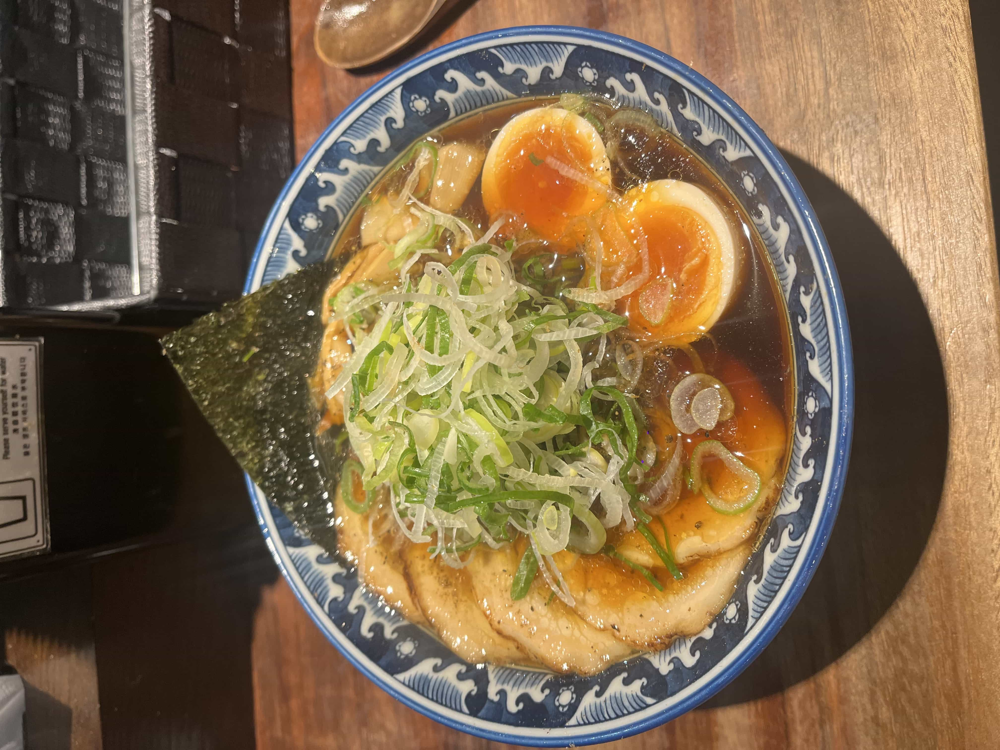
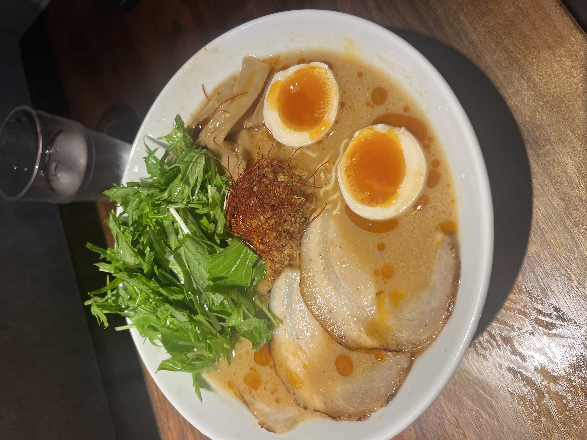
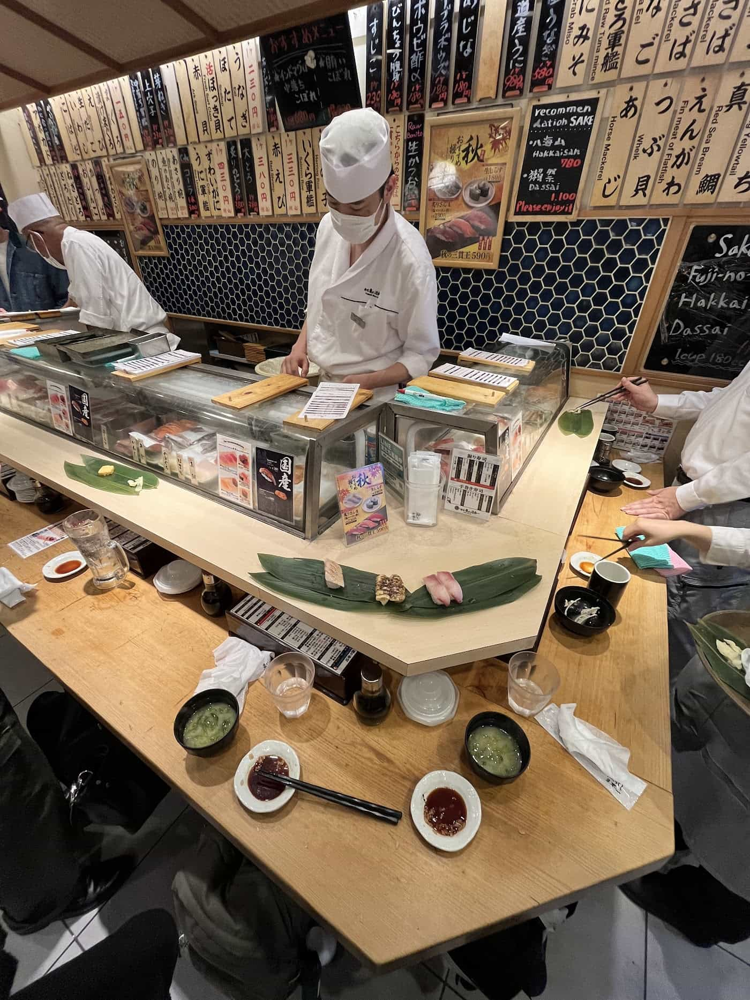
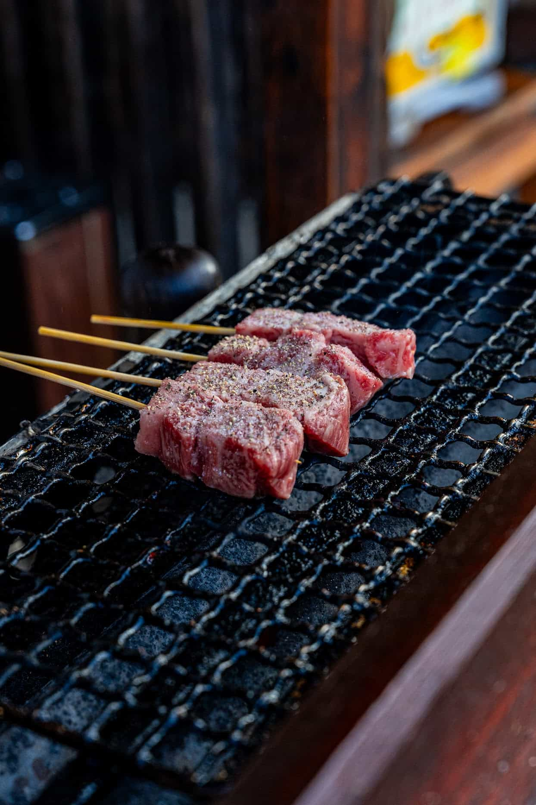

## Overview

This post will be a condensed version of the more detailed Japan journal post. This post will just be rapid fire recommendations for where to eat and what to do in Japan based off our travels while we were there. There won't be a ton of details here as there are countless other posts online with way more information and better writing skills than me.

This post will only cover recs for places we actually went to and experienced. There are many other places we didn't get to go to that are also highly recommended. Let's start with some of the places we went to while in Japan and how we liked them.

## Food

This section is probably the reason you are reading this post or why I shared it with you. There will be no ratings or rankings here, just a list of places that were exceptional and need to be visited if you are near them.

> Note: The headings will be Google Maps links to the location of the place.

### [Glitch Coffee](https://maps.app.goo.gl/H2xjz7RGogZxfXyE6)

- **Where:** Tokyo or Osaka
- **Why:** It will forever change your perspective on what coffee is and what it can be. Consider this a mecca for coffee enthusiasts.
- **What to get:** Anything

We ordered a pour over flight with Geisha coffee and it just tasted so different from anything we have ever had. It tasted closer to a black tea than a coffee. It was so light and delicate. As we were leaving, we got a latte to go and it was the wildest coffee of them all. Despite have no flavorings at all (good) it tasted like a whisky/khalua/vanilla/sugar latte.

### [Fuji Ramen](https://maps.app.goo.gl/k6VqtBeckjfkkzMA7)

- **Where:** Tokyo
- **Why:** Amazing ramen, cheap, owner runs the show, and its cozy
- **What to get:** Soy Ramen with Egg

We ate here on our last night in Tokyo and were so glad we did. You place your order with an automated machine that spits out your ticket. You give it to the owner and the co-owner (maybe co-chef?) and they whip up your ramen. Its a small cozy place with only a few seats. Fantastic ramen and they were so friendly and welcoming.

### [Menya Shirakawa](https://maps.app.goo.gl/76szf7FP6WMqtsNm8)

- **Where:** Takayama
- **Why:** Exceptional ramen
- **What to get:** Any ramen, they have multiple types

Menya Shirakawa and Menya Shirakawa Bettei are two ramen shops in Takayama that serve the same ramen. The "Bettei" variant is only a few doors down from the non-"Bettei" variant. They are the exact same but the "Bettei" variant is in a more modern (less traditional) building but has extended hours. We went to Bettei as the original was closed when we went. The ramen is damn good and super rich.

### [Wajo Ryo Men Sugari](https://maps.app.goo.gl/fhBjGLwsyjC3VT787)

> AKA Wajoryomen Sugari

- **Where:** Kyoto
- **Why:** It is everything a restaurant should be, in its purest form. The ramen is 🔥
- **What to get:** Ramen, its what they serve

In my mind, this is the perfect concept of a restaurant. In fact, I don't actually think a restaurant could be any more perfect. Not only was the food **incredible**, this place was just a vibe and at its absolute core is what every restaurant on this planet should strive to be. Incredible food, affordable, not an ounce of wasted space, thoughtfully designed, fresh, cooked by people who care, and so welcoming you feel like you're eating at a friends house. There is no tipping, no frills, no gimmicks, no servers, no hostess, and no waiters. Just you, the chefs, and dang good food. You sit down, you get incredible food, you enjoy the food, you feel happy, and then you leave. It is that simple and its perfect.

We got here right when this place opened and there was already a line to get in of about 10 people or so. Right when it opened, the owner waved us in and we all shuffled into a hallway behind the kitchen. We queued up behind a ticket machine to punch in our orders. Then we waited in a nice backyard garden while the 12 or so folks that were seated finished their ramen. Above the restaurant, it looked like there was a nice apartment that the owner perhaps lived in. Once two seats freed up at bar, we took our spots, grabbed our utensils from the drawer in front of us, and watched as our bowls of ramen were prepared. While we were waiting, another cook popped in and the other two chefs greeted him with a big smile and a high-five. The chefs looked to all be in there late twenties and were just having a blast whipping up bowl after bowl of ramen.

The ramen was super unique and unlike any other ramen we had in Japan. If you are near this place, I would highly recommend it. 🍜

> [tabelog link](https://tabelog.com/en/kyoto/A2601/A260201/26006820/)

### [Mizuhiki-tei](https://maps.app.goo.gl/vNchu5boxSh3Vkh66)

- **Where:** Kanazawa
- **Why:** Wholesome Shabu-shabu experience by a husband and wife team
- **What to get:** Shabu-shabu

### [Uogashi Nihon-Ichi](https://maps.app.goo.gl/y4HBZ8qASY9NdSV56)

- **Where:** Tokyo
- **Why:** Best sushi we had in Japan
- **What to get:** Sushi

This small sushi is "standing only" and has only a few spots to stand. The sushi is made right in front of you by two chefs. They say that sushi is supposed to be eaten while standing in its traditional form. The sushi here was the best we had on our whole trip in Japan. I would go back to this place in a heartbeat.

### [Wagyu, Sashimi, and Sake Tasting](https://www.airbnb.com/experiences/107577)

- **Where:** Osaka
- **Why:** Personalized experience with a local chef
- **What to get:** Wagyu, Sashimi, and Sake of course

We did this experience with a local chef in Osaka and it was amazing. You book through AirBnb experiences and meet at a small tepanyaki restaurant in Osaka. The sashimi was served with a delcious flakey sea salt that we really enjoyed. The portions of sake were _hefty_ and the Wagyu was also incredible. I would suggest this to anyone looking to hit great sake, sashimi, and wagyu all in one go.

## Cities

### Tokyo

Tokyo is one of those places that everyone really should see once in their lifetime. It is mind blowing how a city of its size exists and functions. At times you might think you are on the ground level of the city, only to realize that you are three stories underground (or 5 stories above ground). It is an wild, busy, and vibrant place. However, it is also a place that can get overwhelming very quickly. We really enjoyed Tokyo but we found ourselves wanting to escape it quickly.

### Kyoto

Incredible place to visit with super rich history. A must see in Japan! We checked out a bunch of shrines / temples that were far off the beaten path and it was great as in some cases we were the only people there. More on this later.

### Osaka

Osaka is still a massive city by all measures but somehow felt more vibrant and alive than Tokyo. We really enjoyed Osaka and wished we had spent more time their than in Tokyo.

### Kanazawa

Kanazawa was one of our favorite places in Japan. It is considered a "hidden gem" of Japan. Some people even call it the "little Kyoto" as well. It is a smaller city in comparison to Tokyo and Osaka but it is still a city. The Shinkansen only connected to Kanazawa in 2015 so it is still relatively new to the tourist scene. The locals really loved to see travelers there and were super welcoming. The town was quiet, peaceful, but still had a lot to offer and amazing food.

### Takayama

Takayama is a small town in the Japanese Alps. It was quite suprising to us that it had some of the best street food on our entire trip. It was a great place to do a lot of walking in nature and it was super scenic. The train ride from Kanazawa to Takayama was also one of the most beautiful train rides we have ever been on, especially since it was peak fall colors for us.

Takayama is known for its **Hida Wagyu** and you should try some if you are there.

> Hida Wagyu from a local street vendor in Takayama

### Nikko

We just did a day trip from Tokyo to Nikko but we really liked it here as well! Felt a bit like Takayama being nestled in the mountains. The shrines and temples were on a whole other level here.
