I have learned a LOT of things in my first 5 days, but for the sake of organization, lets keep them in chronological order.

## Sapporo

Sapporo is the biggest city in Hokkaido, and you *really* feel that on a bike! The ride from the airport wasn’t so bad, it was along the highway and there were many conbinis (convenience stores) to keep me fueled. Along the way I met Shoki, another rider from Southern Osaka. We were both surprised to see each other as we made eye contact from the other side of the highway!

Shoki carried most of his gear in a backpack, and just brought his regular old bike. According to him, Hokkaido was good for sleeping because there are many bus shelters. It was an excellent reminder that, you really just need a bike, and whatever gear you have, to go on an adventure. I find myself getting overly focused on the perfect piece of equipment, but as I would find, you never get everything exactly right.

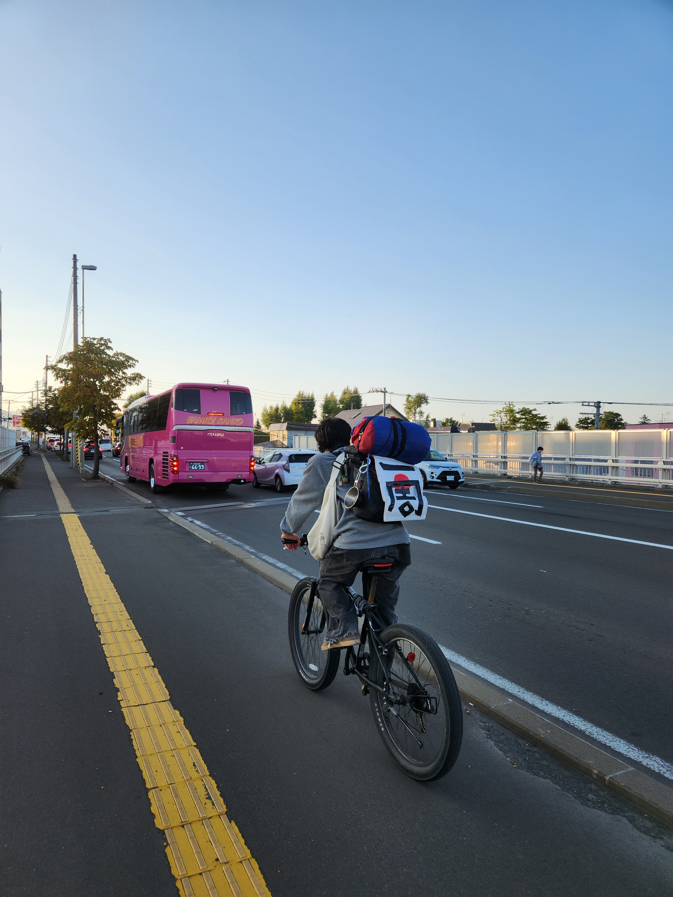

I was glad to run into Shoki because we made a few extra stops along the way, I was very focused on making it to my hostel (which I had accidentally booked 13KM outside of town), but he reminded me that its OK to slow down. On my first day no less. Although, I haven’t really listened to that bit of advice…

We even stopped at the Yuki Matsuri museum, which had the original model of the snow sculpture from when I went!

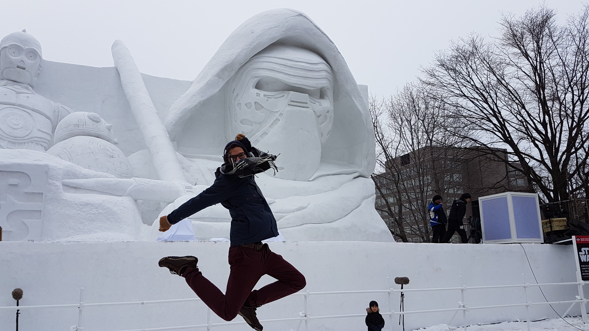

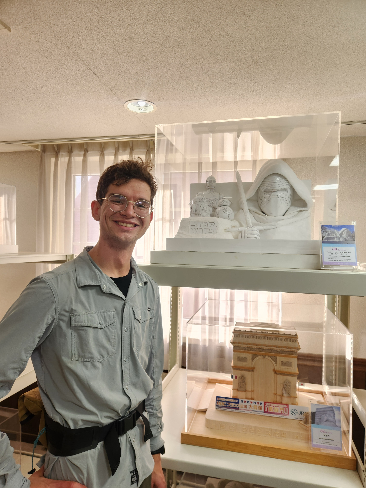

Riding through Sapporo is a skill on its own. City riding in Japan is like a video game, you need to navigate:
- Switching between the road and sidewalk
- Overgrown or rough sidewalks
- Inconsistent stoplights (sometimes all way stop, sometimes no walking sign)
- Students sending it on mama cheri (Mama’s Chariot, colloquial name for a city bike)
- Big signs and flashing lights
- Grandparents strolling along

It’s fun, but slow going, and you really need to watch out!

The next day was quite a bit shorter, really I just went from the Hostel, which was on the outskirts of town, to a hotel in Susukino. I hadn’t been to Sapporo since the Yuki Matsuri (Snow Festival) in 2017. It was really fun to walk around a Japanese city again - it reminded me of when I studied abroad in Tokyo. I stopped at the Taino Station for a game of Chunithm, and Don Quixote (an everything store, it’s where I would get cheap beef!) just to be over-stimulated.

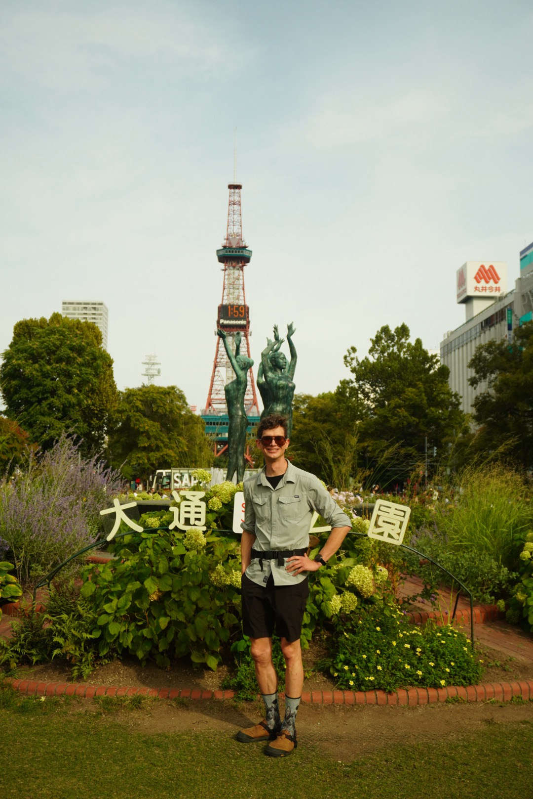

Luckily for me, the Hokkaido Harvest Festival was happening in Odori Park - I tried out lots of local foods. My favorite was a daikon radish soup. One thing I forgot to pack (and could have used for my soup) was a spoon! Luckily, there was a spoon making workshop  where I made a spoon out of birch.

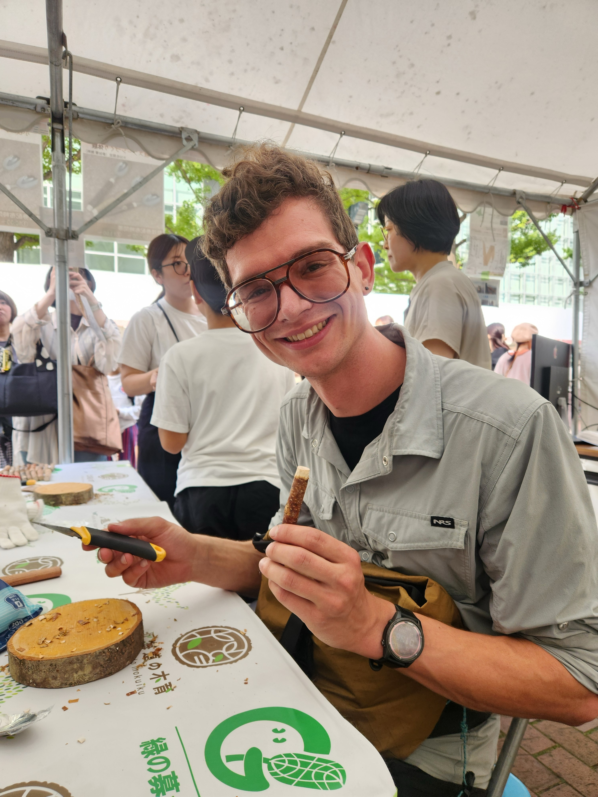

## Yubari and Hobestu - into the mountains

I consider the next day the true start of my trip, I made my way out of Sapporo and into the country side, winding at perfect right angles through the fields. As I rode past a small house, an older lady who was gardening looked up and waved, that’s when it felt like the start of something.

The really tiny towns have only 1-2 places to eat, and they keep very odd hours. Usually 11-1 or until they run out of food. I made it to a small restaurant just in time. They had run out of everything but ramen, which was excellent. Here I learned my new favorite word: 大盛り（おおもり) (oomori) which means ‘large helping’. Since then I always order oomori!

I made it to my first campsite, where I was the only one. And no wonder, because it was cold!!

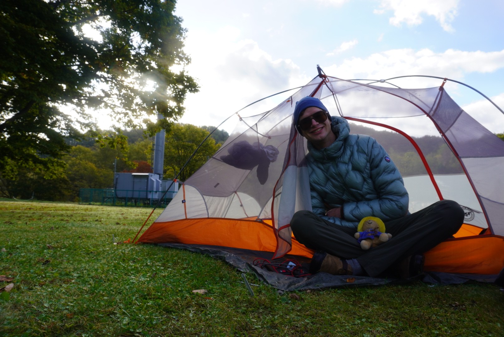

The next day was stunning, but quite challenging, and a learning experience. First I found that many of the roads in Japan are just permanently closed. Like many things here, once they fall into disrepair, due to a landslide or something like that, they never open again. I was unable to take my intended route and had to stick to the highway which had many tunnels.

Tunnels are scary. You cannot tell which direction a car is coming from, you only hear the roar. It sounds a lot like an airplane overhead. There aren’t any sidewalks, but most of the trucks and cars give you plenty of space. You just need to ride as quickly as possible, in as consistent of a manner as possible.

A Garmin Varia or other radar is a must for this, because it can at least tell you when a car is coming from behind! The worst tunnels are uphill and windy, it makes it hard to keep a perfectly straight line, and takes forever.

But after many Kms of tunnels, I have adopted the “しょうがない (shoganai)“ or, “there is nothing to be done” mindset. You can’t avoid the tunnels!

I stopped to take a picture in this particularly friendly tunnel (below).

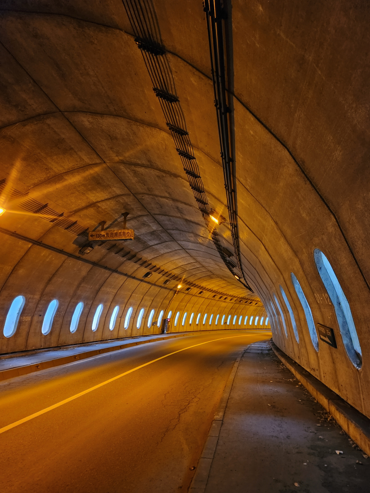

## Minami Furano - reservations needed

After a very cold night, and a questionable forecast, I was keen to make it to the logging town of Minami Furano. It was a beautiful ride, and I enjoyed 2 lunches at the Michi no Eki (Roadside Station) in Shimukappu. I rolled into Minami Furano just as it was getting dark, and discovered that you should make a reservation at the inns in these small towns! The first one was full, and the second had one room left. They were *very* surprised that I had not called ahead.

Phone is the only way to make reservations in the smaller towns. No booking.com!

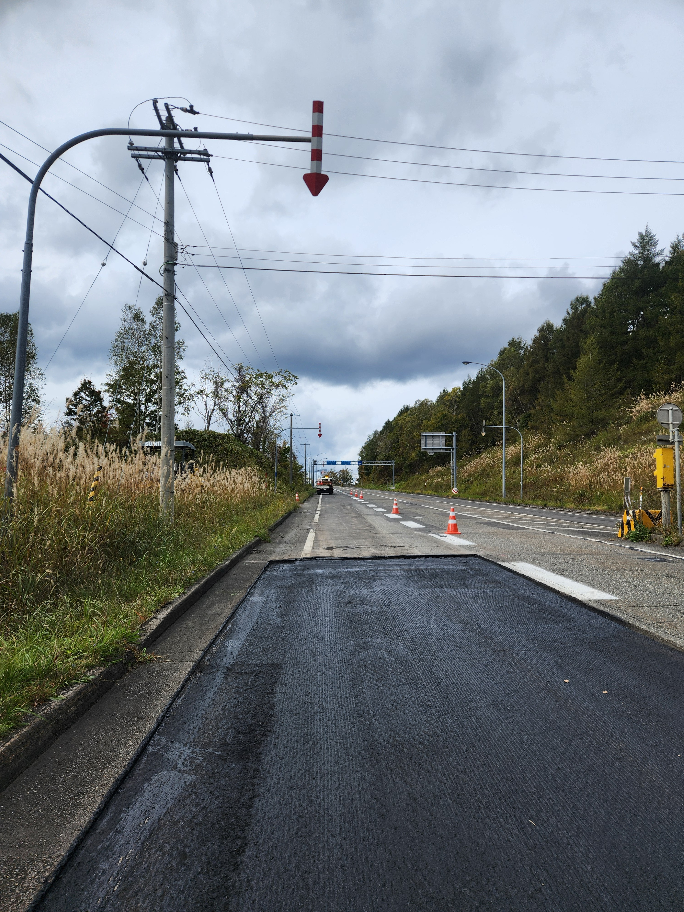

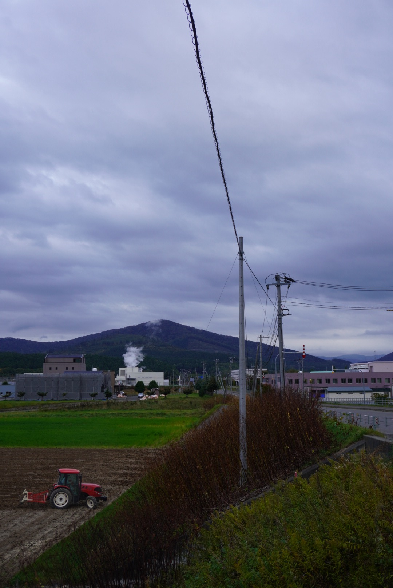

## Shikaoi - Shoki-San and the Drum House

So the next morning I picked up the Pay Phone, for the first time in my life, and called a few places near Shikaoi. Without context clues and body language, a lot of my Japanese breaks down. Luckily, I was successfully able to make a reservation at Shoki-san’s ドラム館　(ドラムかん） (doramu kan), an inn outside of Shikaoi. I am proud of that!

And it was a good thing too, because it rained for most of the day! I completely gave up on keeping my feet and legs dry and adopted the “just don’t stop pedaling and you will stay warm enough” strategy. As I climbed over a pass, I was treated with a break in the clouds and a stunning double rainbow.

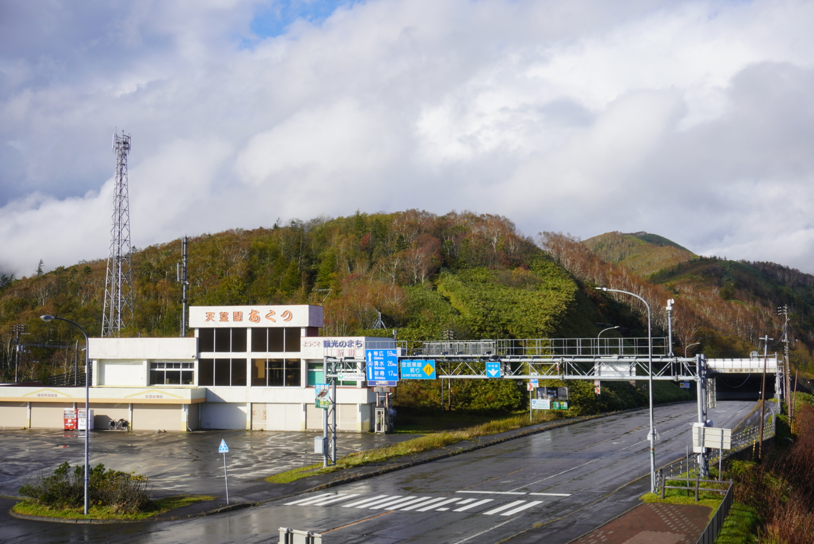

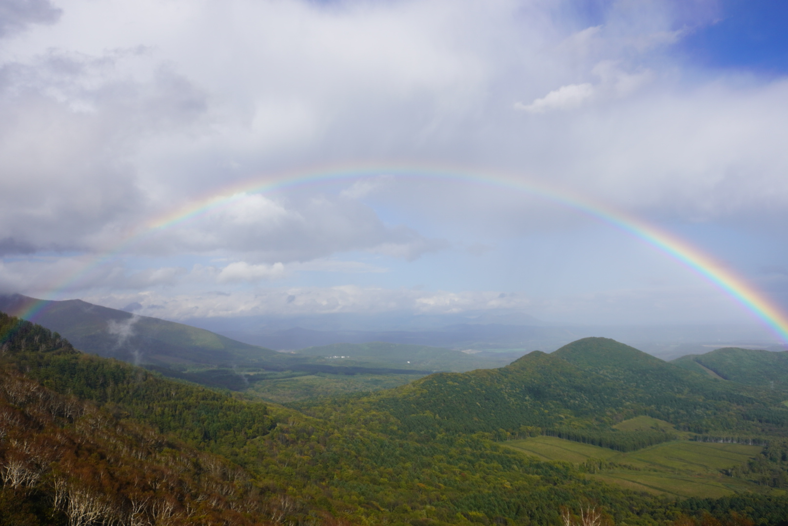

The drum house (literally their house) was amazing. Shoki-San and is brother live together. They are both musicians and their living room is full of instruments. When I arrived, sopping wet, Shoki-San laid out a tarp for all of my gear in the entry way, showed me to the bath, and said “Should we go to the onsen at 5?”. Yes, please!

So the three of us hopped into the car and drove to the onsen, where I soaked in the various baths and did my best to understand the conversations around me. The local onsen was a very social place! More than any moment yet, this one felt like I was truly in Japan.

We spent dinner chatting about travel, Germany (Shoki-San’s sister lived there, and he traveled around in the 80s), and music. He showed me his favorite Japanese artist, Yosui Inoue, and I showed him mine, RADWIMPS.

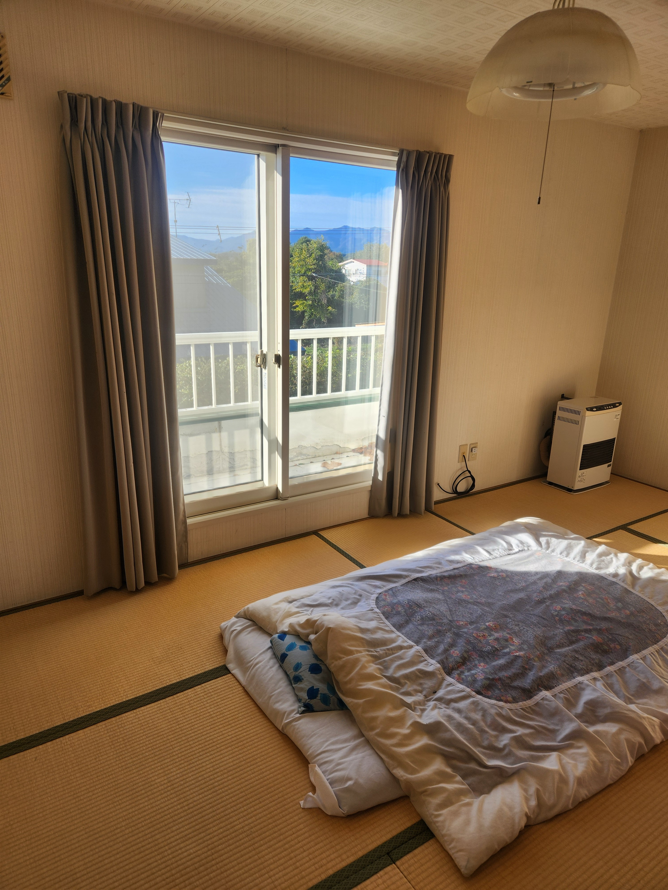

In the morning I was greeted with an amazing breakfast, with my plate being at least twice as big. Oomori indeed! It fueled me well for the climb into Daisetsuzan National Park.

As I left the drum house, Shoki-San and his brother followed me down the driveway, waving, and callout out “行ってらっしゃい (itterashai)” which has a warm implication of safety and an expectation to return.

I am so excited to continue across Hokkaido and Japan, meeting folks like Shoki-San, practicing Japanese, and enjoying the grand view that comes usually comes after a tunnel.

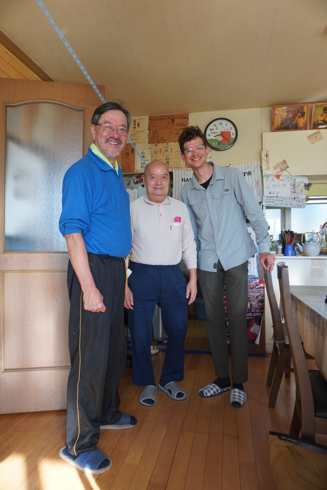

Until next time!

Ian

