## London and Norway

In the fall of 2022 Leah was accepted into one of the best Global Health programs in the UK. She had the opportunity to study at King's College in London and earn her masters while living abroad. It was pretty darn short notice as when her acceptance came through she had only a few weeks to get a visa before she set sail.

At this time it just wasn't feasible for me to join right away. Between things going on with my family, to work logistics, and getting a visa in a matter of weeks; I just wasn't able to go right away. Rather than join her right away, I chose to move to Boulder, CO with a long time friend. I would fly back and forth to visit Leah and I felt this was the best way to support her in achieving her dreams while also doing what made sense given the circumstances at the time.

My first trip to visit her was about a month and a half after she had left to begin her studies. I flew out on November 2nd and landed in London on the 3rd. To Leah's (somewhat) surprise, I had planned an entire trip in Bergen, Norway the day after I got to London. As soon as we woke up the next day, we were on our way to the airport to catch a flight to Bergen!

### Norway 🇳🇴

It was a short trip (only 4 days) but I had the trip packed out with things to do. Everything was planned from start to finish and I was extremely excited to see how it went as usually Leah and I plan all our trips together. It went incredibly well. From start to finish Norway was just a bundle of wonderful surprises.

#### Friday

When we first landed in Bergen on Friday, our first order of business was to pick up our rental car. We headed to the kiosk to pick up our car which was just outside the security area. When I went to pick up the car from the man at the desk he said to me "I have bad news... we only have one type of car. You can only chose the color". I started to feel a tad stressed at this. I had planned the whole trip on my own and I wanted it to go really well, especially for Leah. I asked "well what car and what are the color options?". He replied "Model 3 Tesla, blue or black".

My jaw dropped... "Hell yeah! Black it is!". Fifteen minutes later we were zipping out of Bergen's ultra modern airport is a fully outfitted Model 3 Tesla jamming to MO radio on Spotify.

Now Leah had absolutely no idea where we were going. The only thing she knew is that we were in Bergen and now had a Tesla. Our first order of business was to checkout downtown Bergen and get a bite to eat.

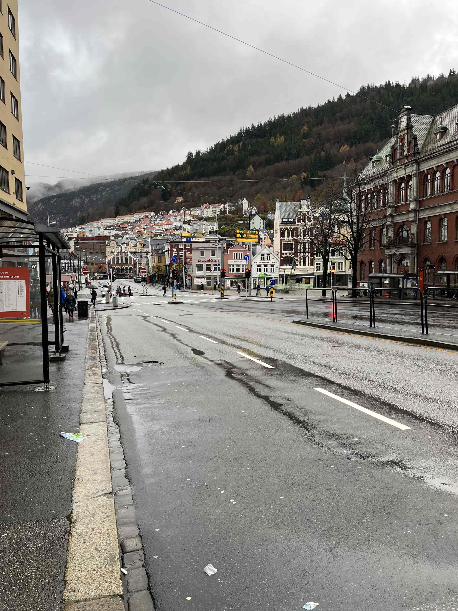

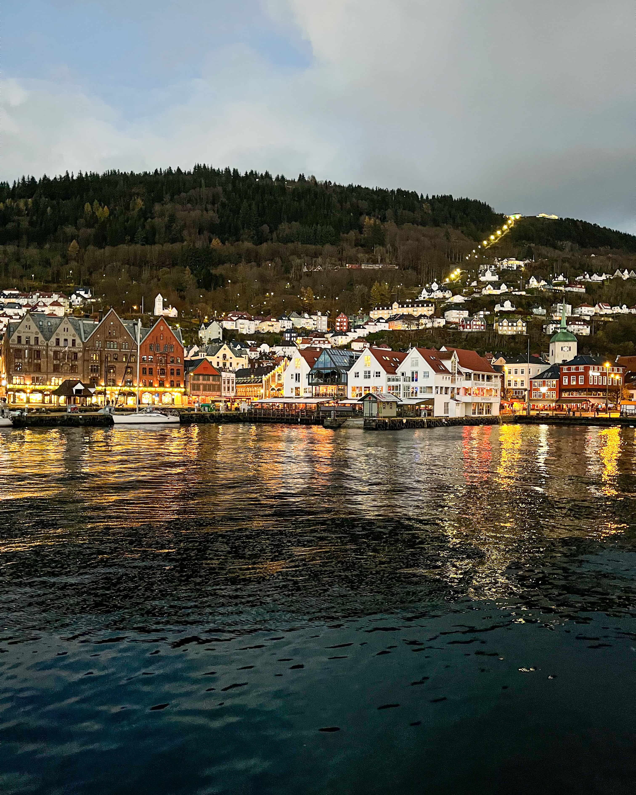

I had reservations at a very nice place for dinner and we popped in a bit before our reservation to check it out. It was honestly too fancy as Leah and I don't like to be too fancy and would rather just eat street food most of the time. We bailed on the restaurant and instead went to find some jackets. We had no jackets at all and it was super cold in November and very rainy. While checking out with our jackets, we ended up chatting for almost an hour with a super friendly woman who worked there. She told us all about her experience living in Norway, and random blurbs about Norwegian culture. Surprisingly, she hadn't skied all that much so we exchanged our contact info and I told her if she ever comes to the US to visit in CO so we can ski. At the end of our conversation she suggested an all you can eat sushi place just up the street. We checked it out and oh boy we are glad that we did. The sushi was stellar and probably 1/4 of the price where I had reservations. Leah and I were all dressed up that night and it was a wonderful date night in rainy Bergen.

After we finished our sushi, we hopped back into our standard issue Norwegian Tesla, set it to auto-pilot, and it drove us to our AirBnb. Leah still had no idea where we were staying. Our AirBnB was a 100+ year old Scandinavian cottage on the edge of a Fjord. It was about 20 minutes outside of Bergen. The cottage was adorable and uber cozy. Leah was so thrilled and seeing her face light up and we opened to door to our cozy cottage instantly made the whole trip worth it right in that moment.

#### Saturday

Equipped with our newly acquired jackets, I woke us up early for our adventure day. I told Leah to get bundled up and we set off to grab coffee and a croissant before heading to a hike I found online. The hike was called *Hananipa from Skulstad* and it started off near a few cottages on a steep road. The trail wrapped around a lake and then snaked up the spine of a Fjord. It think with moody clouds and we were the only ones on the entire trail. The only living things we came across was a herd of yaks. The trail was extremely muddy and practically had a stream flowing down the trail the entire way. After about 30 minutes of carefully navigating our footsteps to not get caked in mud we had both slipped. At that point we laughed, gave up trying to be clean, and just because mud monsters from the knees down.

> The spin of the trail part way up

Apparently the view from the very top of the trail is just Fjords and streams for as far the eye can see. Sadly, it was so cloudy and rainy we couldn't see a single thing so we started to head back down. We still got a pretty nice view as there was a five minute break in the clouds on our way down!

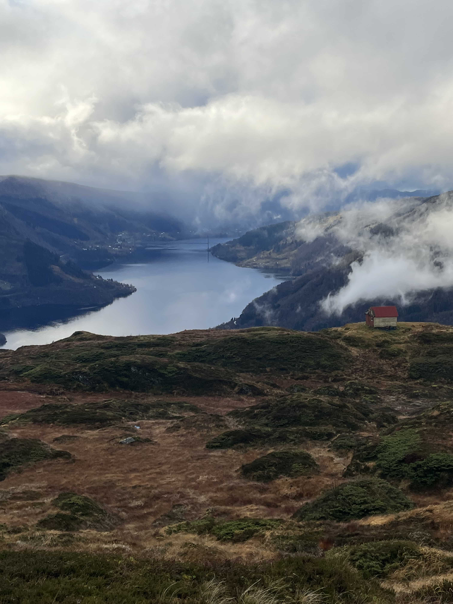

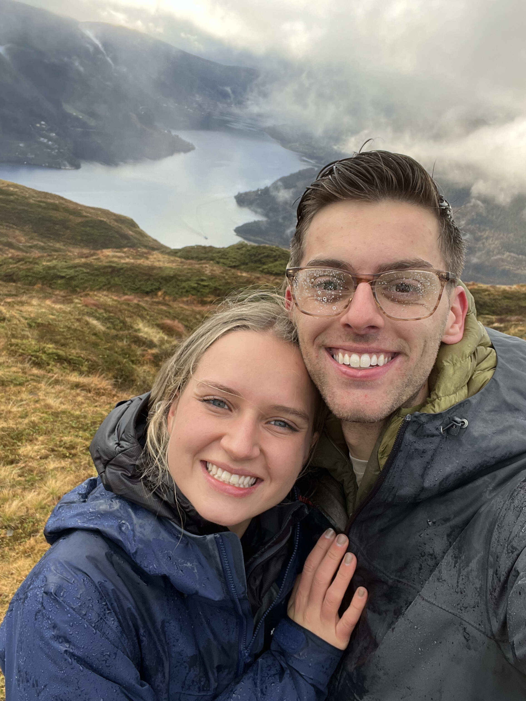

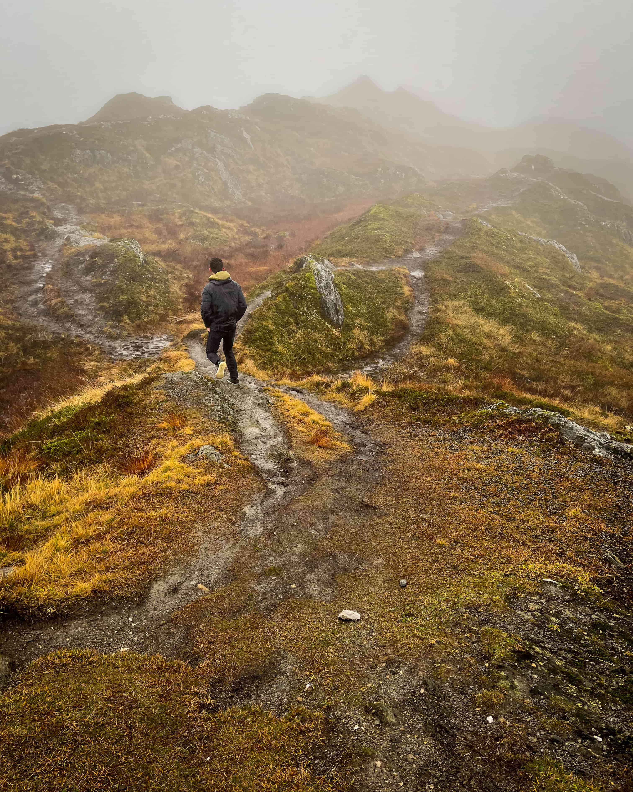

After our hike, we were freezing, covered in mud, and had some wet socks. So we defrosted our selves with the Tesla's air vents. I had plans for two hikes that day but after that one hike we were spent. So instead, we just started driving through the Fjords and stumbled upon a very scenic Norwegian town.

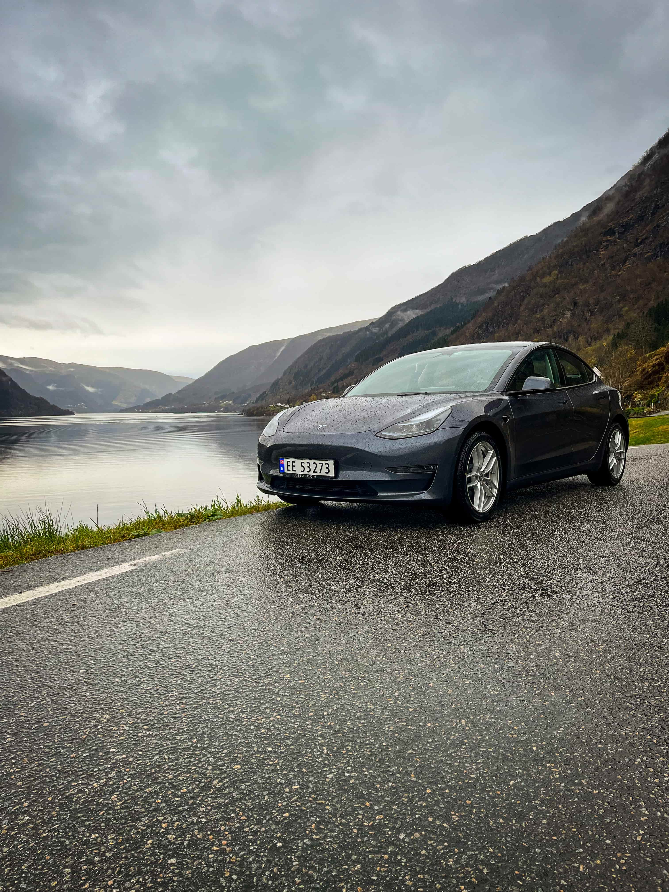

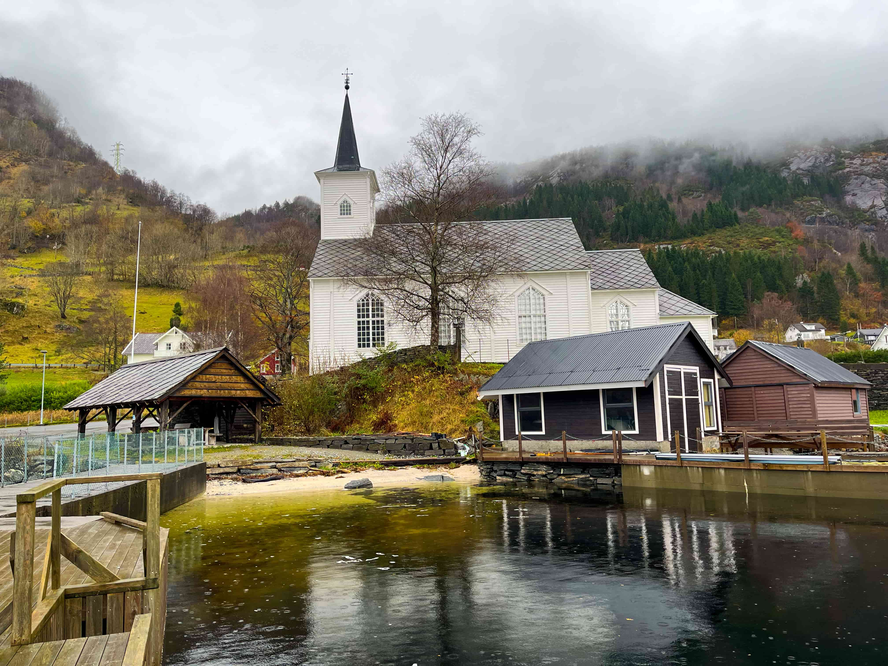

This night I had zero plans for dinner and Leah had an *excellent* suggestion to do "pizza night". So we stopped at a little market in a nearby town and picked up home made pizza supplies and some ciders. We got back to our cottage, took showers, got into cozy bathrobes, made super tasty pizzas, and popped open some ciders. We then ate our pizza on the couch and watched a movie together. It was such a wonderful way to end a long day of hiking in the cold and I was beyond happy to have spent such a fun day with Leah ❤️.

#### Sunday

On Sunday, we had a mellow morning and strolled around downtown Bergen to do some early xmas shopping. Leah released her inner Christmas elf at a few holiday shops. We also stopped for some 10/10 lattes and croissants. I had a Fjord cruise planned for us that afternoon so before we set off on that trip we stopped for some reindeer bratwursts. I'm not sure how Leah's inner Christmas elf felt about consuming Rudolf's cousin but it sure was tasty.

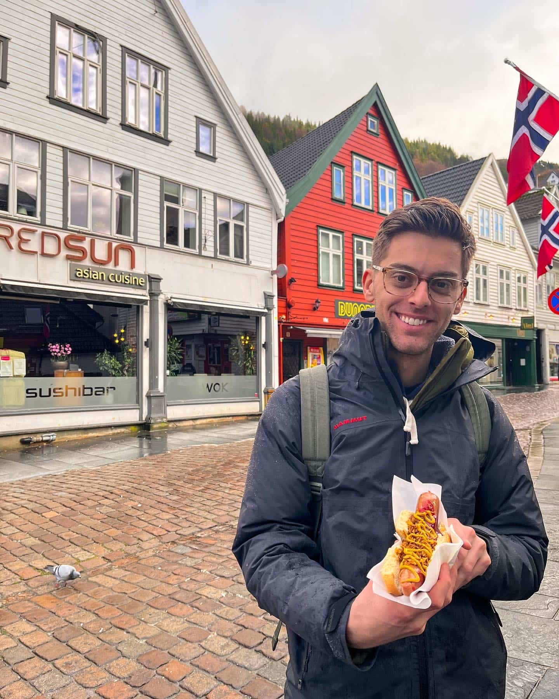

> Grant eating a reindeer bratwurst

No photos will really do the Fjord cruise justice. It started off pretty slow and I was starting to get worried for a moment. After about an hour we turned into a small river channel between two huge Fjords and from that point on it was just magical. The boat we were on was rather large but compared to the massive slabs of rock sticking out of the water comprising the Fjords above, we felt like an ant.

At the very end of the channel there was a huge waterfall coming off of the Fjord and the boat pointed itself right for it. The boat *just keep getting closer*. We were standing up front taking pictures and all of a sudden the front of the boat was literally under the waterfall. We got absolutely drenched but we were laughing, freezing, and it was so worth it.

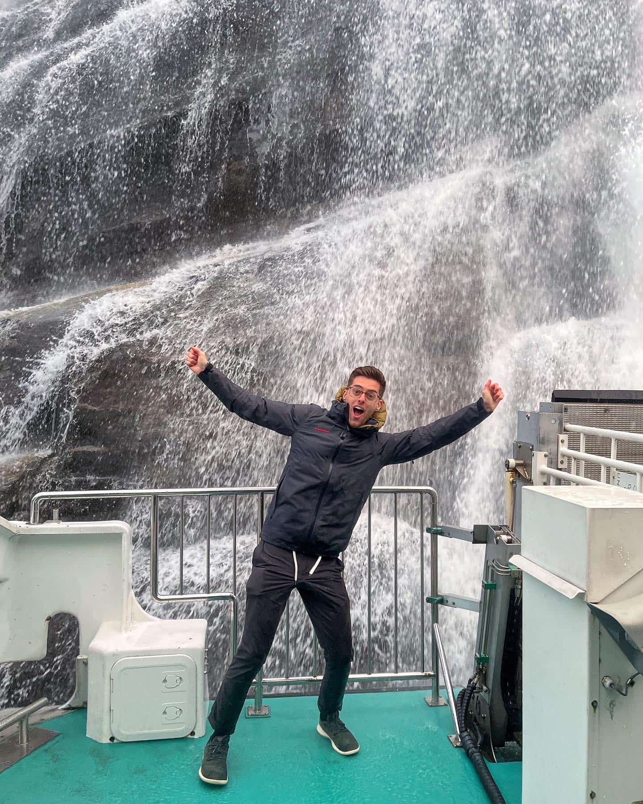

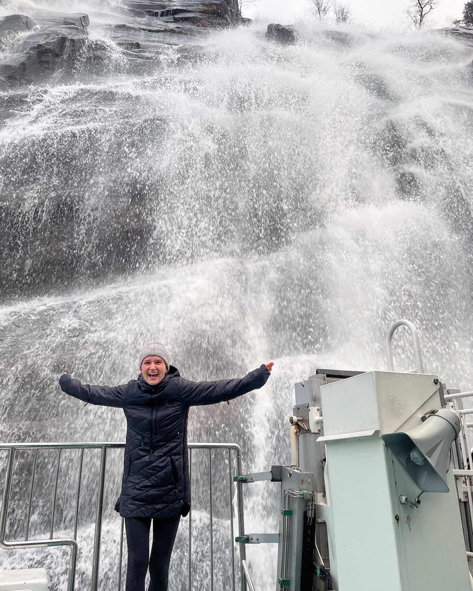

The rest of the ride back we were soaking in our seats, laughing, and looking at pictures. We were quite cold but I knew it was all okay given our next destination.

After the Fjord cruise we drove to the other side of Bergen (only about 8 minutes away) to a traditional Norwegian sauna. It was right in the middle of the harbor with views of the opposite edge of Bergen. It warmed us right up and after you roast for a bit you hop out into the harbor to cool down. The harbor was freezing and the first time we did it I honestly wanted to scream but slowly got adjusted. Leah must have some Scandinavian in her blood though because she handled it like a champ.

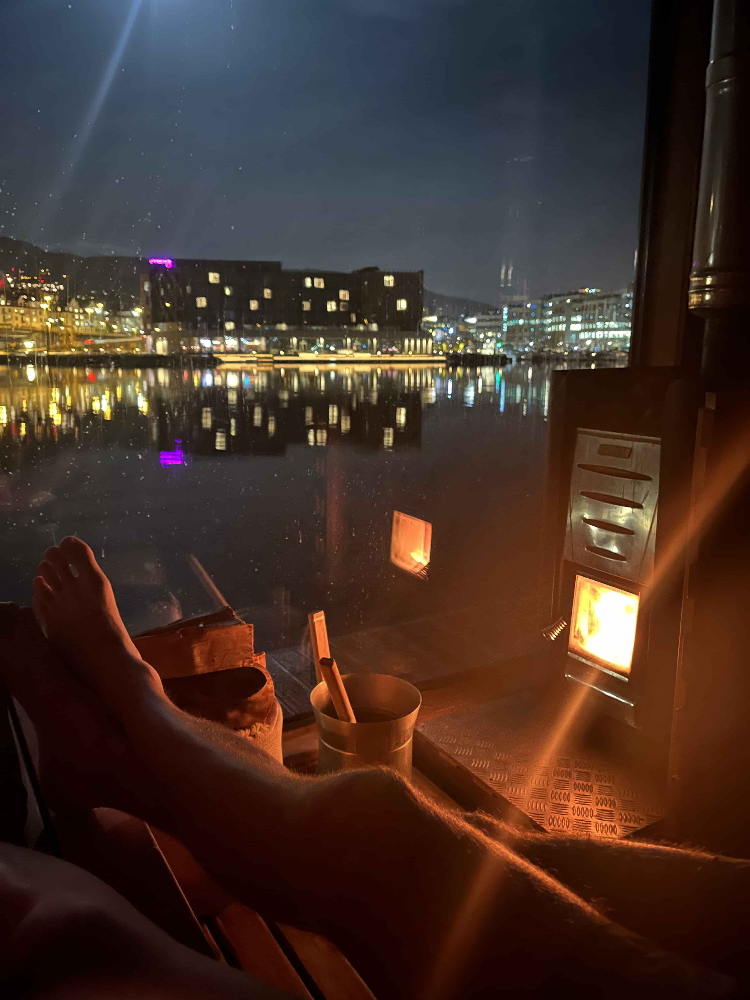

#### Monday

On Monday, we checked out from our cottage (sadly). It was such a special place to stay and we were pretty sad to be leaving. On our ride back into Bergen, we chatted how we would love to live in Norway for a bit one day - even if only for a few months.

Our flight was at 8pm so we enjoyed a nice bowl of soup and strolled around for a bit more before heading over to the airport.

Before we left, Leah made one last candy run to pick up some sweets!

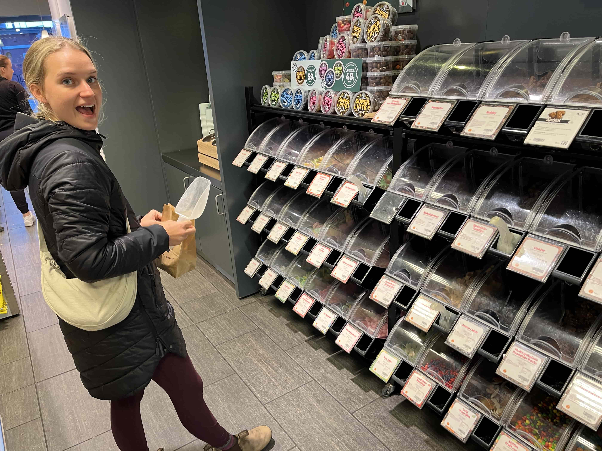

We had an **amazing** time in Norway and it really sparked something in me for traveling again in a new way. Leah and I have planned many of our trips together, but there was something really special about surprising her with this trip and seeing how excited she way about all the fun adventures I had up my sleeve for us.
