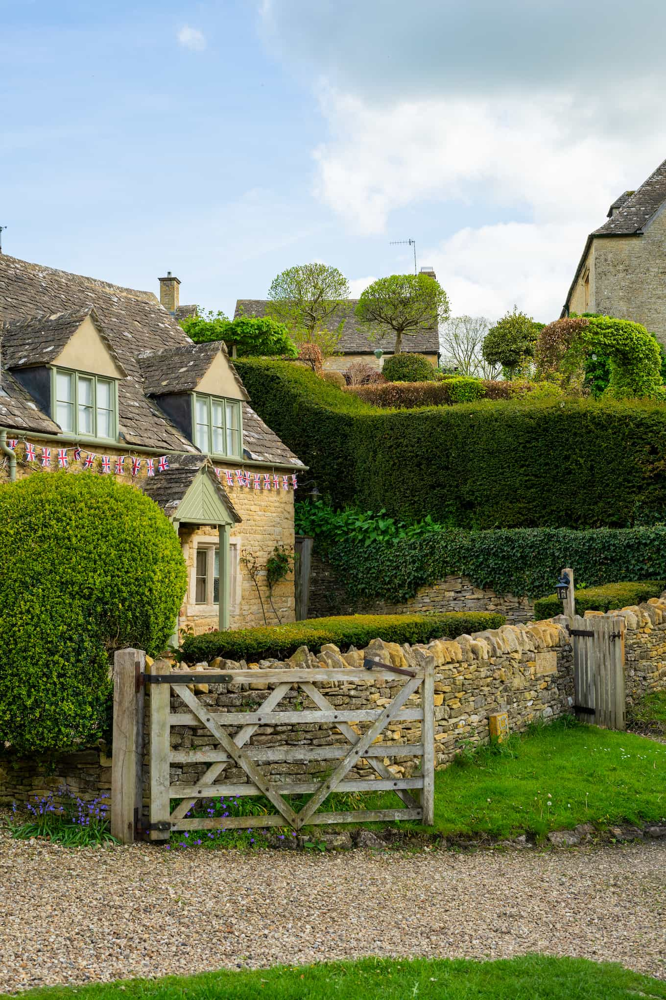

## London and the Cotswolds 🇬🇧

This trip was a monumental one for my family (Joe, Betsy and Brooks). While I have been "over the pond" and have traveled all over Europe, they haven't been to Europe before. This would be their first big international trip and we were all extremely excited! Brooks has wanted to visit London for a very long time and years ago Leah and I even gave him a "voucher" for a trip to London and visiting the Harry Potter studio tour. My parents have both wanted to visit Europe for a while and visit some of the many beautiful places that they have heard about and seen photos of. My family decided to make this vision a reality now that Leah and I have more or less been living in London for the past few months.

The "Birkinbine EU Trip" would consist of three parts. First, we would explore London. Second, we would venture out to the Cotswolds and visit the small towns and villages that make up the area. Third, we would visit the Greek Islands. This post will cover the first two parts of the trip and the blog post about the Greek Islands can be found [here](/posts/greek-islands).

Let's begin!

> P.S. Massive thank you to Leah for being a star tour guide and master-planner for a large portion of this trip! ❤️

### London

Joe, Betsy, and Brooks flew direct from Denver to London and we met up with them at their hotel in the "Bank" district of downtown London. We had a few activities planned to keep them awake and stave off the jet lag from their long travel day.

We walked around the bank district for a bit and crossed Tower Bridge on our way to a pub Leah and I have been to for "Pub Quiz". We popped into the pub for a quick bite to eat and Joe managed to become a brit within only hours of landing by downing a pint 🍺.

> Joe and Brooks standing in front of Tower Bridge in London

Everyone was so excited to be together and to be in London that the Birkinbine family really didn't have any troubles with the jet lag at all! Joe, Betsy, and Brooks headed back to the hotel that evening and Leah and I headed home to get some rest before the next day's adventures.

The next day was the grand Harry Potter studio tour! This was the trip that Leah and I have given a "voucher" for to Brooks years ago and we were now finally cashing in on it with him. Brooks is a **huge** Harry Potter fan and has read all of the books and seen all of the movies multiple times. Leah and I haven't seen all of the movies so we leaned on him as our personal tour guide to answer many of our questions.

> Brooks going through the 9 3/4 wall at the Harry Potter studio tour

The next day in London was certainly a unique one. The queen had actually passed away that fall and this meant that the country was preparing for the coronation of the new king. By sheer luck this happened to occur on the second day that my family was in London! Betsy, Joe, and Brooks were extremely excited to witness the coronation front and center so they got up really early and headed over to Trafalgar Square to get a good spot. They managed to actually get in and get a view of the King passing by in his carriage! Leah and I slept in too late (we aren't morning people haha) so we got stuck in the sea of people outside.

> Leah posing in the street after the King's Coronation

### Bourton-on-the-Water

Our next stop on the UK portion of our trip was [Bourton-on-the-Water](https://en.wikipedia.org/wiki/Bourton-on-the-Water) which is a small town in the Cotswolds. The Cotswolds is a region in the UK that is known for its rolling hills and small villages.

We took the train from London to Bath to pickup our rental car but ran into quite the snafu. We had arrived to Bath after the rental car office had closed due to the King's Coronation. The greater problem was that every single other rental car place nearby was also closed due to the national holiday so we couldn't get a car *anywhere*. We ended up having to take a taxi all the way to our Airbnb in Pershore which wasn't cheap to say the least but we survived (such is the life of travel).

We really enjoyed our Airbnb in Pershore and it was in a really quaint little town just outside of the Cotswolds. That night we got there, we had dinner at a really nice little pub and the meal was delicious which was a great way to end the rather wild day of the Coronation and the rental car snafu.

Our next day we got up early to obtain our newly reserved rental car and went to checkout the town of Bourton-on-the-Water! Here are some photos from our time there:

> Leah and Betsy on the edge of a canal in Bourton-on-the-Water

> Betsy on the edge of a canal

> Betsy and Joe

> Brooks and Leah

> The canal in Bourton-on-the-Water covered in flags to celebrate the King's Coronation

We followed a path on the edge of town which took us past some nice pastures and sheep. There were lots of baby sheep and we found a scenic spot to stop and take some photos.

> A quiet part of the canal in Bourton-on-the-Water

### Slaughter

The towns of "upper" and "lower" Slaughter were right next to Bourton-on-the-Water so we decided to check them out as well. We parked our car in the town of lower Slaughter and walked to upper Slaughter. The walk was really nice and we saw lots of sheep and cows along the way.

> Sheep on the path from lower to upper Slaughter

> Betsy on a canal in upper Slaughter

> Cottages in upper Slaughter

> Leah on a bridge

> A small shop in lower Slaughter

> Leah and Brooks

> Classic UK telephone booth

### Broadway

Personally, I loved the town and area surrounding Broadway! This was our next stop along the trip the day following our time in Bourton-on-the-Water and Slaughter.

Our first stop was the Broadway Tower which is a tower on top of a hill that overlooks the town of Broadway and the surrounding area. The best part of the tour (and one of the best tours I have done in the entire UK) was the old [nuclear bunker](https://broadwaytower.co.uk/nuclear-bunker/) that was built nearby the tower during the Cold War. The tour was lead by former members of the Royal Observer Corps who were stationed at the bunker during the Cold War. They were extremely knowledgeable and gave us a great tour of the bunker and the history of the Cold War in the UK. They were also extremely enthusiastic and I personally really enjoyed the tour!

After the nuclear bunker we checked out the tower which provided some pretty awesome view of the area.

The icing on the cake was the small craft store next to the tower. While in shop, I found this cute little frog who's name was Jeremy. I picked him up and immediately ran up to Leah in excitement. She looked at Jeremy and said "we are taking him home". So we bought Jeremy and he joined our family for the rest of the trip!

> Our new friend Jeremy! We found him in a shop next to the Broadway tower and he joined our family

After the tower and bunker we went into the town of Broadway. It was an adorable little town and we found a nice older couple selling ice cream so we got a few scoops while walking around.

> Pretty flowers in the town of Broadway

### Oxford

Since we had a bit of rental car snafu, we had to return our car in Oxford instead of Bath. This ended up being a blessing in disguise because we got to spend a few hours in Oxford which was a treat for my family. I even happened to stumble across a GitHub meetup with some coworkers and had lunch with them!

> Brooks in Oxford

> Another shot at Oxford

> The narrow streets of Oxford

> A courtyard in Oxford

> Grant (me) happened to meetup with some coworkers at the GitHub office in Oxford for lunch

My family had an amazing time in the UK. We saw many of the classic sights and also got to explore great places in the Cotswolds. Personally, I was just so excited to get to see how happy my family was doing an international trip together. Both Leah and I were constantly surprised by just how great of travelers my family was on their first big trip overseas. It seemed like the universe certainly aligned in our favor with the King's Coronation taking place while we were all there as well! I am so grateful for the opportunity to travel with my family and I hope we get to do it again soon!

The "Birkinbine EU Trip" continues on in the [Greek Islands](/posts/greek-islands) post!
