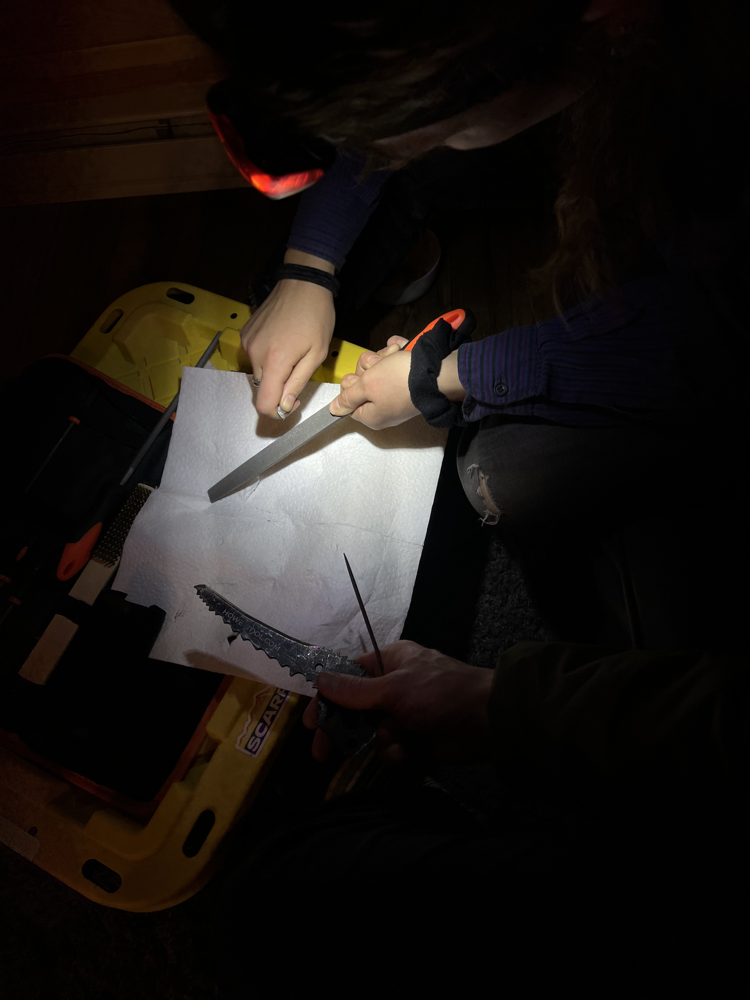
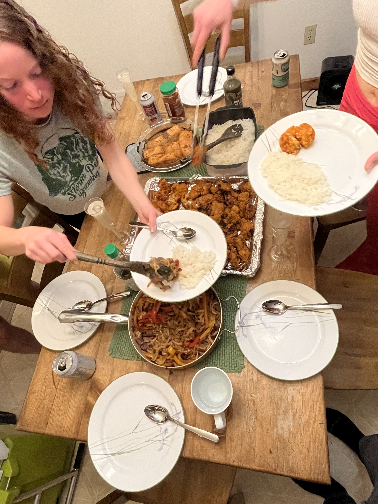
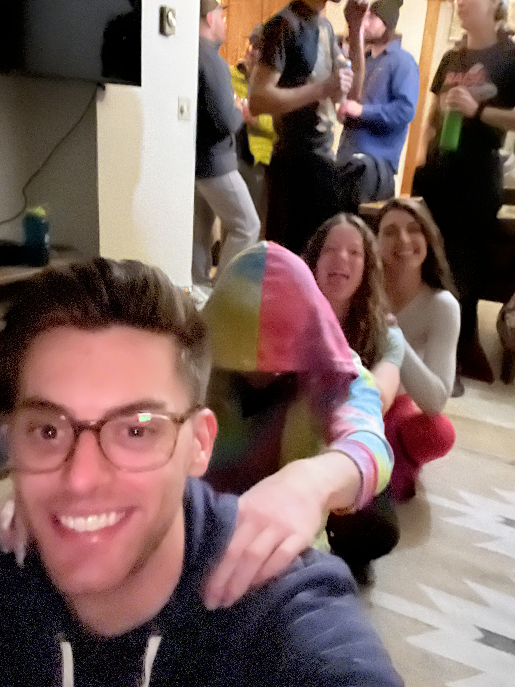
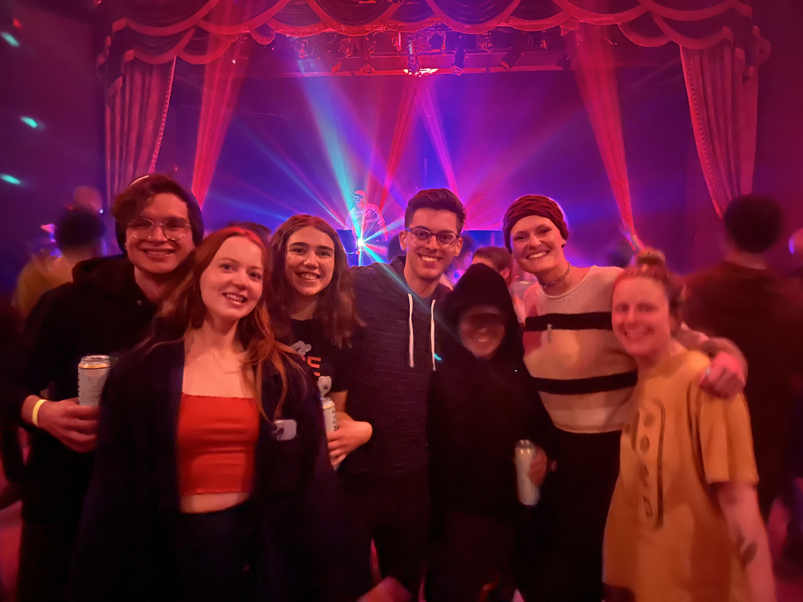
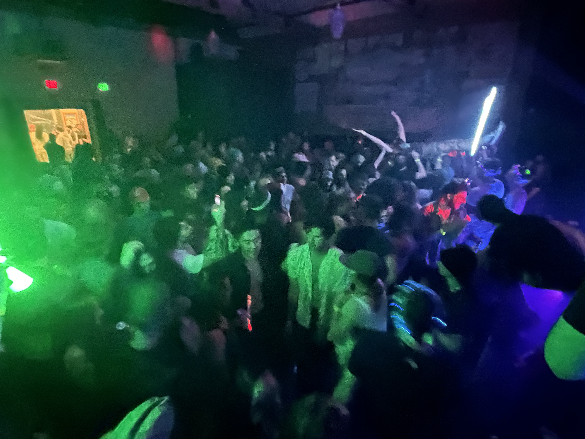

## Ouray Ice Festival 2023

Back in 2021, Leah got me into rock climbing. Initially, I really didn't want to get into the sport in any meaningful way. I had fun doing indoor sport climbing and bouldering, but I wasn't really interested in improving. This changed pretty quickly though when I first tried outdoor climbing. It proved to be rather challenging and I set out to improve in the gym to be able to climb better on real rock. Over the next year I would find myself owning a harness, carabiners, slings, and actively seek out climbing. It quickly became something I enjoyed quite a bit and all my friends had been onboard with the sport for quite a while.

During the winter of 2021, Leah's family asked their friend Dillie to take us ice climbing up Fish Creek Falls. It wasn't something that any of us had done before and it was actually a done of fun even though it was rather exhausting a bit terrifying.

### Thursday

Flash forward to 2023 and my friends in Boulder have invited me to join them to the Ice Climbing Festival in Ouray, CO. This is one of the largest ice climbing festivals in North America and it draws people from all over the world. It is miles of frozen ice walls that are created by the park service from a long running water pipe with control valves. The event is entirely free and only requires balls of steel and a high tolerance to adrenaline (not even joking).

Myself and about 15 other friends set off on Thursday night to get to Ouray. Half of us stayed in a cabin and the other half of us stayed in a really nice VRBO condo. Dillie actually stayed at the condo with us which was really nice as he took me on my first ever ice climb and he was now throwing me into a baptism by ~~fire~~ ice in Ouray.

On Thursday night, myself and Nyika sharpened a few dull ice tools to ensure they would grab the ice well.

A few people went to a pool party that included a live DJ and free drinks. We played a few card games and went to bed early to get up and hit the ice walls.

### Friday

Now I have only ever climbing on ice one time before. This was absolutely **not** something for beginners. I found this out within moments of being lowered down my first ice wall. Dillie was on top belay and lowered me deep into crevasse. As soon as I reached the point on the wall where I would start climbing, I looked up and felt my heart rate top out. It was a really good thing I went pee beforehand...

In the image above, the person in the light orange jacket is the route that we all climbed. It was incredibly difficult. About half way up I was certain that I would need to rescue team to pull me out. My arms were so pumped out I could hardly swing the ice tools into the ice to get a proper hold. Just when I thought I had a good hold, I would put my weight on the tool and the ice would either give out or my tool would slip out. It took me nearly twenty minutes to make the ascent and as soon as I got to the top I just collapsed to breathe. Even though it was extremely difficult, I made it through and was actually quite impressed with myself for being able to accomplish that route. I later learned it was a `WI4+` route which is certainly quite the route to be thrown into for your second ever ice climb.

That was the only climb I could stomach for our first day so I spent the rest of the day exploring the festival, checking out the ice climbing competition, drinking coffee, and taking pictures. Oh and also trying to flush the adrenaline out of my arms.

That night we refueled with a nice family dinner and an hour long massage train.

> Family dinner at our VRBO condo

> Massage trains after a long day of climbing

### Saturday

The next day we found a more "intermediate" canyon to climb in that was a lot less intimidating. You would belay for the bottom so no matter how difficult it got, you could always bail and that was very reassuring. I managed to get two route in when climbing in this canyon area.

> Ian W. and climbers in a canyon

> Ian C. climbing

> Grant (me) climbing

> Grant (me) on an ice ledge

> Ian C. climbing

After climbing, we went and soaked in the Ouray hot springs which was a great way to relax our very sore climbing muscles. We need to decompress a bit before heading out to the "Petzl party" that night. The "Petzl party" is a live DJ event sponsored by Petzl that including unlimited free drinks, and dancing with all the folks from the ice climbing festival.

> The climbing crew at the Petzl DJ party

> Another view of the Petzl DJ party

The Petzl party's free drinks were... a dangerous thing. We got a little bit "hydrated" due to this. After the Petzl party we decided that it would be lovely to have another soak in the hot springs but they were now closed as it was midnight. Did that stop us from soaking? I'm not sure but that's all I'll say here 🤷‍♂️.

### Sunday

On Sunday we were all pretty spent physically. Many of us still managed to climb despite a significant lack of sleep and still feeling a bit "dizzy" from the night before. I spent most of the day editing photos at a nice local coffee shop while others just did a quick route up at the festival before heading home.

Overall, it was an amazing trip. We all challenged ourselves physically, mentally, and some of us might have even challenged ourselves socially. We climbed hard, gave the weekend everything we had in the tank, and had a blast.

> Nyika climbing a WI4+ route (we all climbed a WI4+ route!)
